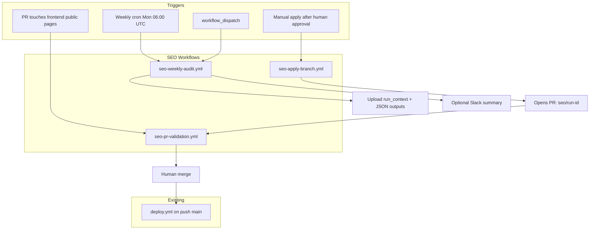
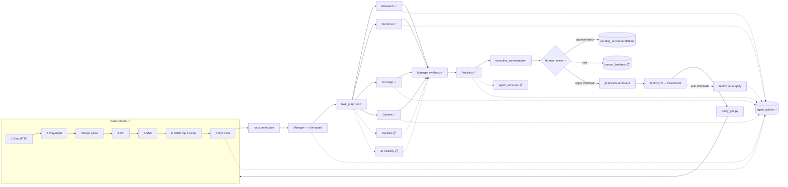
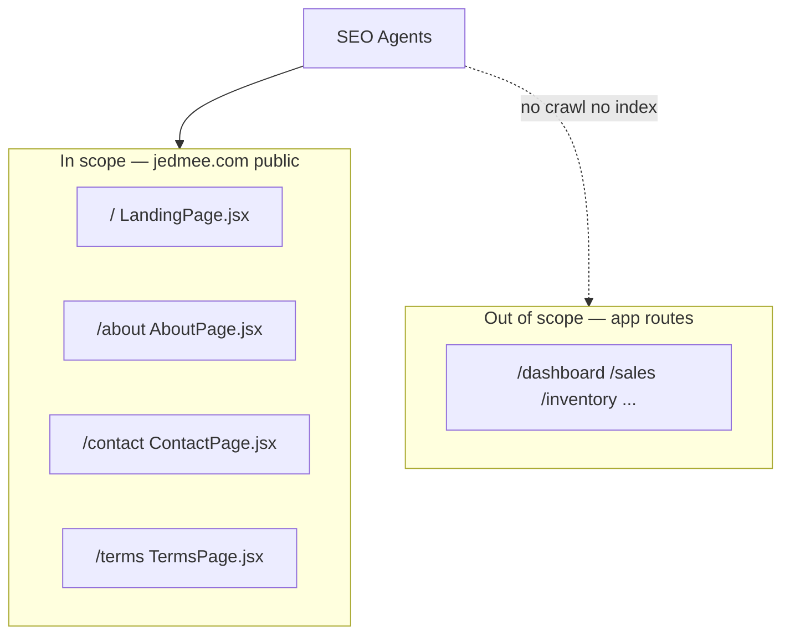
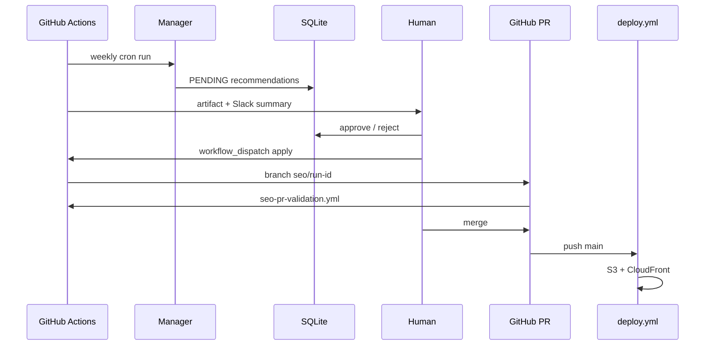
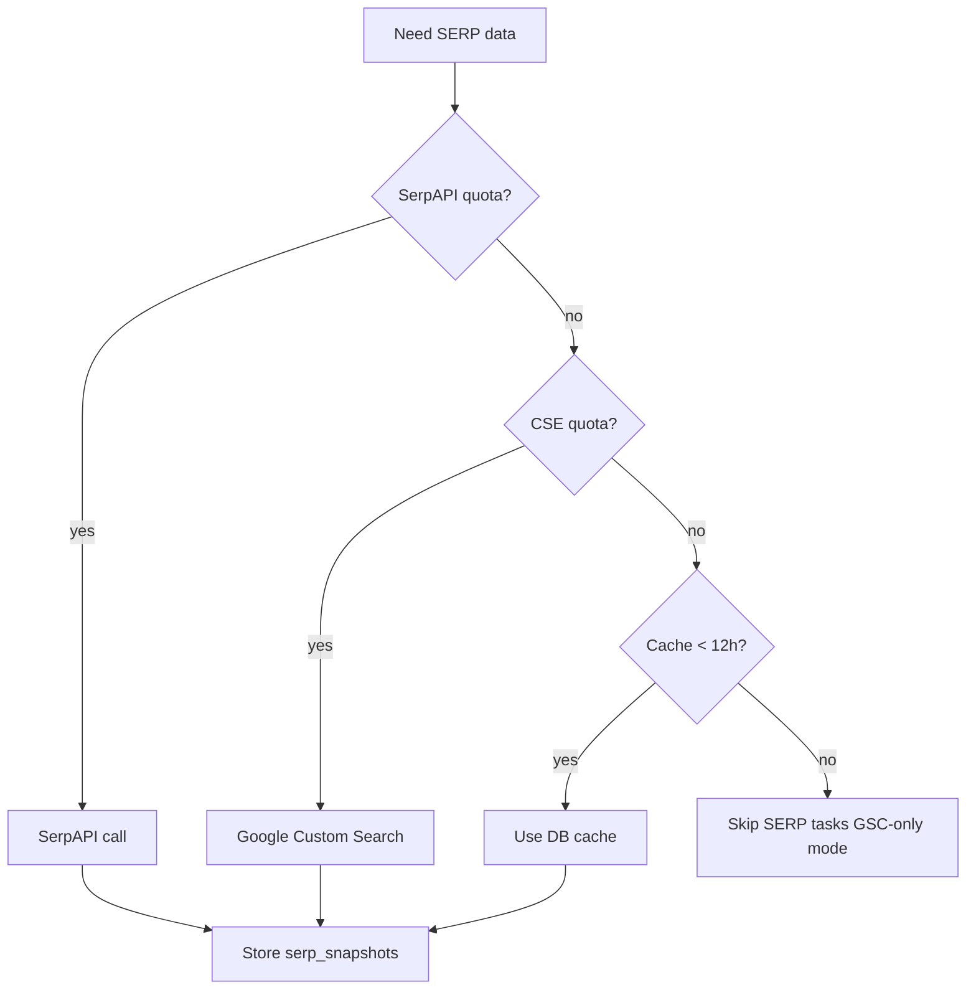
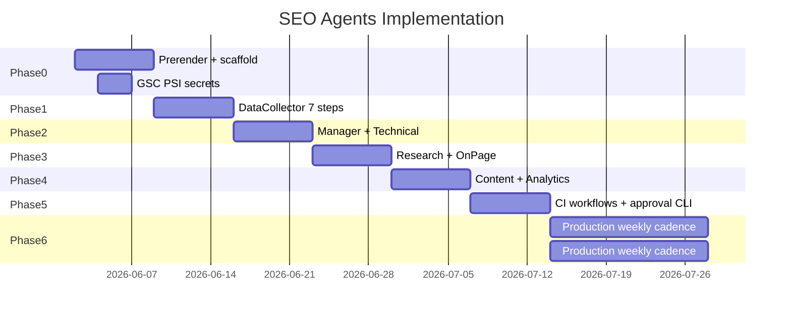
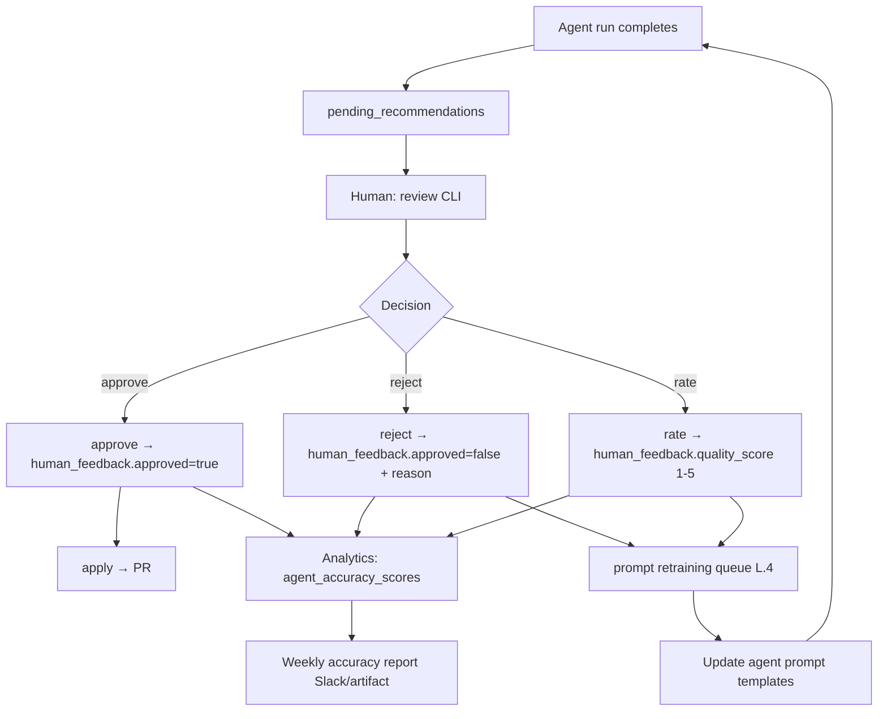

# JedMee SEO Multi-Agent System — Production Redesign
> **Author:** Senior SEO Architect & Multi-Agent Systems Review  
> **Source plan reviewed:** SEO_AGENTS_IMPLEMENTATION_PLAN.md (2026-06-01)  
> **Status:** Full critical audit + production-ready redesign  
> **Core principle:** Every run is research-first. No hardcoded keywords. No template outputs. Manager reasons from fresh evidence every cycle.

> **Implementation sync (2026-06-06, final):** This document is the **single source of truth** for JedMee SEO agents — architecture, code paths, GitHub CI, third-party APIs, frontend targets, and what remains to build. Give this file to any Cursor session to extend frontend, backend, or agents.
>
> Status tags: **✅ Implemented** · **🔶 Partial** · **📋 Planned** · **❌ Not possible (paid API)**

### Document map (all parts)

| Part | Title | What it covers |
|------|-------|----------------|
| **M** | **Cursor Handoff Guide** | **START HERE** — full repo map, secrets, workflows, DB, agents, frontend, what's left |
| A | Critical Audit | Flaws in the original static checklist plan |
| B | Redesigned Architecture | DataCollector, Manager, **6 worker agents ✅** (+ Backlink **📋**) |
| C | Research & Scrape Pipeline | Tools, DB schema (13 tables), sample JSON |
| D | Manager Pseudocode | `plan_sprint()` + `synthesize()` |
| E | Additional Gaps | Human approval, llms.txt, CI, prerender, quota |
| F | Third-Party APIs | Every external service: setup, limits, fallbacks |
| G | GitHub Pipeline | 5 SEO workflows + deploy.yml integration |
| H | Phased Rollout | Week-by-week plan, deliverables, exit criteria |
| I | File-by-File Process | Every `seo-agents/` file (~54 files): inputs, outputs, when it runs |
| J | Dynamic Agent Runbooks | Step-wise flows per agent driven by `run_context.json` |
| K | Architecture Diagrams | Mermaid flows for the full system |
| L | Human Trust & Feedback Loop | **✅** `rate` CLI, `human_feedback` table; prompt retraining **📋** |

### Implementation Status (quick reference)

Last verified: **2026-06-06**. Full detail in **Part M**.

| Area | Status |
|------|--------|
| Core pipeline (collect → 6 agents → stage → apply/deploy) | ✅ |
| DB: 13 tables, migrations `001`–`008` | ✅ |
| GitHub: 5 SEO workflows + `deploy.yml` SEO steps | ✅ |
| Human feedback + `rate` CLI | ✅ |
| SERP v2 (PAA, headings, related searches) | ✅ |
| AI Visibility | 🔶 Gemini only (free tier) |
| Content auto-apply | 🔶 FAQ additions only |
| Backlink Agent | ❌ Needs paid SE Ranking / Ahrefs |
| Reddit SERP mining | ❌ Extra SerpAPI quota |
| Prompt retraining from rejections | 📋 |
| `schemas/*.json` | 📋 |

---

## PART M — Cursor Handoff Guide (read this first)

> **Purpose:** Any Cursor (or developer) can use this section alone to understand the full JedMee SEO system — what exists in code, what runs in GitHub, what third-party keys are needed, and what frontend/backend files agents touch.

### M.1 Monorepo layout

```
JedMee-user/                          # git root
├── frontend/                         # React 19 + Vite — DEPLOYED to S3/CloudFront
│   ├── scripts/prerender.mjs         # ✅ Prerenders /, /about, /contact, /terms
│   ├── src/pages/
│   │   ├── LandingPage.jsx           # SEO_CONFIG + useSeoMeta + useJsonLd + FAQs
│   │   ├── AboutPage.jsx             # useSeoMeta + useJsonLd (AboutPage schema)
│   │   ├── ContactPage.jsx           # useSeoMeta + useJsonLd (ContactPage schema) ✅
│   │   └── TermsPage.jsx             # useSeoMeta + useJsonLd (WebPage schema) ✅
│   ├── src/utils/seo.js              # useSeoMeta(), useJsonLd() hooks
│   └── public/
│       ├── sitemap.xml                 # 4 public URLs
│       ├── robots.txt
│       └── llms.txt
│
├── seo-agents/                       # Python multi-agent SEO system
│   ├── main.py                       # CLI entry (9 commands)
│   ├── config.py                     # Paths, API keys, quotas
│   ├── agents/                       # Manager + 6 workers + orchestrator
│   ├── collectors/                   # DataCollector Steps 1–7
│   ├── tools/                        # DB, patches, LLM, GSC, scoring
│   ├── db/migrations/                # 001–008 SQL migrations
│   ├── scripts/                      # 8 operational scripts
│   ├── outputs/<run_id>/             # gitignored JSON artifacts
│   ├── db/runs.db                    # gitignored SQLite
│   └── secrets/                      # gitignored GSC OAuth JSON
│
├── .github/workflows/
│   ├── deploy.yml                    # ✅ Main deploy + SEO auto-optimize
│   ├── seo-weekly-audit.yml          # ✅ Monday cron
│   ├── seo-pr-validation.yml         # ✅ PR gate (validate_public_seo.py)
│   ├── seo-apply-branch.yml          # ✅ Manual apply → PR
│   └── seo-gsc-health.yml            # ✅ Daily GSC health
│
└── docs/SEO_AGENTS_IMPLEMENTATION_PLAN.md   # THIS FILE
```

### M.2 Third-party services & credentials

| Service | Used by | Required? | Env var (local `.env`) | GitHub secret | Free tier |
|---------|---------|-----------|------------------------|---------------|-----------|
| **Google PageSpeed Insights** | DataCollector Step 4, TechnicalAgent | **Yes** | `GOOGLE_PSI_API_KEY` | `GOOGLE_PSI_API_KEY` | ~25k req/day |
| **Google Search Console API** | Step 5, Analytics, deploy notify | **Yes** | `GSC_OAUTH_CLIENT_JSON`, `GSC_OAUTH_TOKEN_JSON`, `GSC_AUTH_MODE=oauth` | `GSC_OAUTH_CLIENT_JSON`, `GSC_OAUTH_TOKEN_JSON` (base64 JSON files) | Free |
| **SerpAPI** | Step 6, ResearchAgent | **Yes** | `SERPAPI_KEY` | `SERPAPI_KEY` | 100 searches/month |
| **Google Custom Search** | SERP fallback | Optional | `GOOGLE_CSE_API_KEY`, `GOOGLE_CSE_CX` | same | 100/day |
| **Google Gemini** | ContentAgent, AIVisibilityAgent | Optional | `GEMINI_API_KEY` | `GEMINI_API_KEY` | Free tier generous |
| **Anthropic Claude** | ContentAgent fallback | Optional | `ANTHROPIC_API_KEY` | `ANTHROPIC_API_KEY` | Pay-per-token |
| **Playwright Chromium** | Step 2 (local/weekly audit) | Yes in full runs | N/A (installed) | CI installs via action | Free (compute) |
| **Slack Webhook** | Weekly audit notify | Optional | `SLACK_WEBHOOK_URL` | `SLACK_WEBHOOK_URL` | Free |
| **AWS S3 + CloudFront** | Frontend deploy | **Yes** (existing) | N/A | `AWS_*`, `FRONTEND_S3_BUCKET`, `CLOUDFRONT_DISTRIBUTION_ID` | Existing infra |
| **SE Ranking / Ahrefs** | Backlink Agent | ❌ Not implemented | — | — | **Paid only** |
| **ChatGPT / Perplexity APIs** | Full AI Visibility | ❌ Not implemented | — | — | **Paid only** |

**One-time GSC OAuth setup (local):**
```bash
cd seo-agents
# Save OAuth client JSON → secrets/gsc-oauth-client.json
python scripts/authorize_gsc_oauth.py
python scripts/notify_gsc.py   # should print gsc_api: submitted
```

**CI writes `.env` automatically:** `scripts/setup_ci_env.sh` (used by `deploy.yml` and `seo-weekly-audit.yml`).

### M.3 CLI commands (`seo-agents/main.py`)

| Command | When to use | Writes frontend? |
|---------|-------------|------------------|
| `collect` | Data only (Steps 1–7) | No |
| `run` | Full audit, stage recs for review | No |
| `deploy` | Production: audit → auto-apply ONPAGE → (CI builds/deploys) | Yes (ONPAGE meta only in CI) |
| `review` | List pending/approved/rejected recs | No |
| `approve` | Approve recs + log `human_feedback` | No |
| `reject` | Reject rec + log `human_feedback` | No |
| `rate` | Score rec quality 1–5 + update `agent_accuracy_scores` | No |
| `apply` | Apply approved ONPAGE + FAQ content patches | Yes |
| `activity` | View `agent_activity` audit log | No |

```bash
python main.py run --goal "Weekly audit"
python main.py review --run-id <uuid>
python main.py approve --run-id <uuid> --rec-id R001
python main.py rate --run-id <uuid> --rec-id R001 --score 4
python main.py apply --run-id <uuid>
python main.py activity --run-id <uuid>
```

### M.4 Agents (what each does + output file)

| Agent | File | Input | Output JSON | Can patch frontend? |
|-------|------|-------|-------------|---------------------|
| **Orchestrator** | `agents/orchestrator.py` | — | `report.md` + all agent JSONs | Coordinates only |
| **Manager** | `agents/manager.py` | `run_context.json` | `task_graph.json`, `executive_summary.json` | No — stages recs |
| **TechnicalAgent** | `agents/technical.py` | ctx, tasks | `technical.json` | No |
| **ResearchAgent** | `agents/research.py` | ctx, tasks | `research.json` | No — uses SERP v2 PAA + heading trees |
| **OnPageAgent** | `agents/onpage.py` | ctx, tasks, results | `onpage.json` | Stages `file_patch` for `useSeoMeta` |
| **ContentAgent** | `agents/content.py` | ctx, tasks, results | `content.json` | Stages FAQ/section proposals |
| **AnalyticsAgent** | `agents/analytics.py` | all results | `analytics.json` | No — GSC week-over-week |
| **AIVisibilityAgent** | `agents/ai_visibility.py` | ctx | `ai_visibility.json` | 🔶 Gemini only; probes 3 prompts |

**Run order:** collect → Manager.plan → Technical → Research → OnPage → Content → Analytics → AIVisibility → Manager.synthesize → stage.

**Manager is rule-based Python** (no LLM). `MANAGER_MODEL` in config is unused.

### M.5 DataCollector steps (`collectors/data_collector.py`)

| Step | Module | Third-party | Output in `run_context.json` |
|------|--------|-------------|------------------------------|
| 1 Raw HTTP | `http_crawler.py` | — | `pages[].raw_*` |
| 2 Playwright | `playwright_crawler.py` | Chromium | `pages[].rendered_*` (skippable `--skip-playwright`) |
| 3 Repo parse | `repo_parser.py` | — | `repo_parse.*` from JSX + sitemap + robots + llms.txt |
| 4 PSI | `psi_client.py` | Google PSI API | `pagespeed` |
| 5 GSC | `gsc_client.py` | GSC OAuth API | `gsc_summary`, `gsc_queries` |
| 6 SERP | `serp_client.py` | SerpAPI / CSE | `serp_snapshots` (incl. PAA, related searches), `competitor_pages` (H1–H6 trees) |
| 7 SPA delta | `render_delta.py` | — | `pages[].spa_risk_score` |

### M.6 Database (SQLite `seo-agents/db/runs.db`)

Migrations run automatically on first command via `tools/db.py:init_db()`.

| Migration | Tables / changes |
|-----------|------------------|
| `001_init.sql` | `runs`, `page_snapshots` |
| `002_rendered_columns.sql` | ALTER `page_snapshots` — rendered HTML, headings, SPA risk |
| `003_api_cache.sql` | `api_cache`, `quota_usage`, `serp_snapshots` |
| `004_recommendations.sql` | `sprints`, `pending_recommendations`, `agent_outputs`, `gsc_baselines` |
| `005_agent_activity.sql` | `agent_activity` — per-task audit log |
| `006_serp_v2_columns.sql` | ALTER `serp_snapshots` — `people_also_ask`, `related_searches`, `answer_box` |
| `007_human_feedback.sql` | `human_feedback`, `agent_accuracy_scores` |
| `008_ai_visibility.sql` | `ai_visibility_snapshots` |

**13 tables total:** `runs`, `page_snapshots`, `api_cache`, `quota_usage`, `serp_snapshots`, `sprints`, `pending_recommendations`, `agent_outputs`, `gsc_baselines`, `agent_activity`, `human_feedback`, `agent_accuracy_scores`, `ai_visibility_snapshots`.

### M.7 GitHub workflows (what runs when)

| Workflow | Trigger | What it does |
|----------|---------|--------------|
| **`deploy.yml`** | Push to `main` | SEO `deploy` (auto-ONPAGE) → build+prerender → S3 → CloudFront → `notify_gsc.py` → `[seo-auto]` commit if JSX changed |
| **`seo-weekly-audit.yml`** | Mon 06:00 UTC + manual | Full `run` (read-only) → `render_summary.py` → optional Slack → upload artifacts |
| **`seo-pr-validation.yml`** | PR touching public pages | `validate_public_seo.py --mode static` → build → `--mode live` |
| **`seo-apply-branch.yml`** | Manual `workflow_dispatch` | `apply --no-git` → commit → open PR |
| **`seo-gsc-health.yml`** | Daily 12:00 UTC + manual | `check_gsc_health.py` |

**GitHub secrets required for SEO CI:**

| Secret | Used in |
|--------|---------|
| `GOOGLE_PSI_API_KEY` | weekly audit, deploy |
| `SERPAPI_KEY` | weekly audit, deploy |
| `GSC_OAUTH_CLIENT_JSON` | weekly audit, deploy, GSC health (base64 OAuth client file) |
| `GSC_OAUTH_TOKEN_JSON` | same (base64 token file) |
| `GEMINI_API_KEY` | optional — Content + AI Visibility |
| `SLACK_WEBHOOK_URL` | optional — weekly Slack summary |

### M.8 Scripts (`seo-agents/scripts/`)

| Script | Purpose |
|--------|---------|
| `setup_ci_env.sh` | Write `.env` + decode GSC OAuth secrets (CI) |
| `authorize_gsc_oauth.py` | One-time local GSC OAuth browser login |
| `notify_gsc.py` | Resubmit sitemap post-deploy |
| `validate_public_seo.py` | 7 static + live prerender checks (PR CI) |
| `check_gsc_health.py` | Daily GSC credential check |
| `render_summary.py` | GitHub Step Summary for weekly audit |
| `notify_slack.py` | Post run summary to Slack (optional) |

### M.9 Frontend patching (what agents can auto-change)

| Patch type | Tool | Target file | Auto in `deploy`? | Auto in `apply`? |
|------------|------|-------------|-------------------|------------------|
| ONPAGE title/meta/keywords | `tools/jsx_patcher.py` | `*Page.jsx` `useSeoMeta` | **Yes** | Yes (if approved) |
| FAQ addition | `tools/content_patcher.py` | `LandingPage.jsx` `SEO_CONFIG.faqs` | No | Yes (if approved) |
| New H2 section / llms.txt | — | — | No — manual | No — manual |
| sitemap lastmod | — | `public/sitemap.xml` | No | No |

### M.10 What is NOT built (and why)

| Item | Status | Blocker |
|------|--------|---------|
| **Backlink Agent** (`agents/backlink.py`) | ❌ | SE Ranking (~$44/mo) or Ahrefs (~$99/mo) — no free API |
| **Full AI Visibility** (ChatGPT, Claude, Perplexity probes) | ❌ | Paid API keys per platform |
| **Reddit intent mining** | ❌ | Burns SerpAPI quota |
| **Prompt retraining from rejections** | 📋 | Needs ≥20 rated recs; design in Part L |
| **Section expansion auto-apply** | 📋 | LLM-generated copy — human review required |
| **`schemas/*.json`** | 📋 | Agent output schemas not formalized yet |

### M.11 How to extend (for Cursor)

**Add a new public page (e.g. `/pricing`):**
1. Create `frontend/src/pages/PricingPage.jsx` with `useSeoMeta` + `useJsonLd`
2. Add route in frontend router
3. Add path to `frontend/scripts/prerender.mjs` routes
4. Add to `seo-agents/config.py` → `PUBLIC_PATHS`, `FRONTEND_PAGES`, `PUBLIC_URLS`
5. Add to `frontend/public/sitemap.xml`
6. Update `scripts/validate_public_seo.py` checks
7. Update `seo-pr-validation.yml` path filters

**Add a new agent:**
1. Create `seo-agents/agents/my_agent.py` with `run(ctx, tasks, results) -> dict`
2. Register in `agents/orchestrator.py` after existing agents
3. Add tasks in `agents/manager.py:plan_sprint()`
4. Log via `tools/activity_log.py`
5. Stage recs in `manager.py:stage_for_review()` if needed
6. Add migration if new DB table required

**Add a new third-party API:**
1. Add env var to `config.py` + `.env.example`
2. Add GitHub secret + `setup_ci_env.sh` line
3. Gate via `tools/quota_manager.py`
4. Call from appropriate collector or agent
5. Document in Part F of this file

### M.12 Full run flow (today)

```
collect (Steps 1–7) → run_context.json
  → Manager.plan_sprint → task_graph.json
  → Technical → Research → OnPage → Content → Analytics → AIVisibility
  → Manager.synthesize → executive_summary.json
  → Manager.stage_for_review → pending_recommendations
  → human: review | approve | reject | rate
  → apply: ONPAGE meta + FAQ patches → git branch seo/<short-id>
  → OR deploy (CI): auto-approve ONPAGE → build → S3 → GSC notify
```

All steps logged to `agent_activity`. View with `python main.py activity --run-id <uuid>`.

---

## PART A — Critical Audit of the Original Plan

### A.1 Fundamental Architecture Flaws

**Flaw 1 — The plan is a static checklist dressed as an agent system (§4.2, §5, §9)**

Every agent has fixed "target keywords" baked in at design time. Section 4.2 literally hardcodes seed keywords: *"pharmacy management software, pharmacy billing software, GST pharmacy software…"* The keyword agent's job is described as validating a pre-existing list, not discovering what JedMee actually could rank for based on real SERP evidence. This defeats the entire point of an autonomous agent. If you know all the keywords in advance, you don't need an agent — you need a spreadsheet.

The same problem infects the on-page agent (§4.2, "Per-page checklist" is a static table), the content agent (§4.2, "v1 content scope" is pre-decided before any data is seen), and the manager (§5 flow is deterministic — it always runs the same steps in the same order regardless of what the data shows).

**Flaw 2 — No research pipeline exists (missing entirely)**

There is no step where the system scrapes the live JedMee pages before running agents. The plan references JSX source files extensively, but the live rendered DOM (what Google actually sees, post-JS) is never captured. A pharmacy SaaS page that renders beautifully in React may present near-empty HTML to a fast bot. This is the most important thing to measure and it's not in the plan.

No competitor page is ever read. The keyword agent calls SerpAPI to get a list of URLs, but nowhere does any agent fetch, parse, and structurally compare a competitor's page against JedMee's page. "Rank 11–20 → Content Agent (section expansion)" in §4.2 Analytics is the right instinct — but the content agent has no competitor content to expand against.

**Flaw 3 — The Manager Agent is a router, not a brain (§4.1, §5)**

The "decision engine" in the plan is literally: "Run Technical audit first. Keyword research in parallel. On-Page + Content use keyword output. Analytics runs last." This is a hardcoded DAG, not a manager. A real manager agent must look at the data from the crawl phase and decide:

- Is there a `noindex` tag on `/`? → Technical is P0, everything else blocked.
- Did GSC show a 40% CTR drop on `/` this week? → On-Page title rewrite is P0, not keyword research.
- Are 3 of 4 pages not indexed yet? → Technical + sitemap are the only tasks this sprint.
- Did a competitor just rank #1 with a 2,400-word guide? → Content agent gets an expansion task.

None of this conditional logic is described. The plan's §4.1 says "manager_agent" and "process=Process.hierarchical" in CrewAI — but that's configuration, not decision-making.

**Flaw 4 — SPA/rendering risk is acknowledged but not solved (§2.3)**

Section 2.3 correctly identifies that `useSeoMeta` runs in `useEffect`, meaning meta tags are injected after JavaScript executes. But then it lists three options and says "the Technical SEO Agent owns auditing and recommending this." Recommending is not solving. By Phase 0 Week 1, you need to have already chosen and shipped a prerender strategy. Otherwise every subsequent agent is auditing and optimizing content that Google cannot reliably read. The entire system is built on sand until this is fixed.

The plan does not include any agent step that actually verifies what HTML Google sees vs. what a browser sees. There is no Playwright or headless Chrome step to render pages and compare the rendered DOM to the raw HTTP response.

**Flaw 5 — Free API limits are dangerously underestimated (§6)**

SerpAPI free tier: 100 searches/month. The plan calls this sufficient for "keyword research + competitor gap." Run the math: 6 target keywords × 10 SERP result URLs × weekly runs = 60 keyword lookups/week × 4 weeks = 240/month minimum. That's 2.4× the free limit in Month 1 before you add competitor page fetches or long-tail discovery. Either budget for SerpAPI Pro ($50/mo) from Day 1 or build a Google Custom Search fallback with a hard rate-limit gate.

Google PSI API: "~25k/day with key" is technically true, but the plan calls PSI for 4 URLs × 2 strategies (mobile + desktop) = 8 calls per run. That's fine. But the plan also mentions caching results in SQLite — this is essential and should be enforced in code (TTL: 6 hours minimum), not listed as an afterthought.

GSC API: Free and generous, but the OAuth setup for a service account is non-trivial. The plan's §6 says "download JSON → Search Console API enabled" in one line. In practice: create GCP project → enable Search Console API → create service account → add service account email as a "full" user in GSC → download key. Missing any step silently breaks the analytics agent. This needs a setup script.

**Flaw 6 — Agent overlap between On-Page and Content agents (§4.2)**

The On-Page agent "reads local JSX source, diffs against keyword map, produces recommendations." The Content agent "reads SEO_CONFIG.faqs, keyword JSON, produces copy suggestions." In practice these agents will produce contradictory outputs for the same page. On-Page says "H1 should target 'pharmacy billing software'" while Content says "rewrite hero to lead with GST compliance." The Manager has no described mechanism to reconcile these or serialize their execution so Content reads On-Page's output.

**Flaw 7 — No data schema for agent-to-agent communication (§4.2 outputs)**

The plan defines loose output shapes (§4.2 keyword JSON example is good) but on-page, content, and technical agents output Markdown files. Markdown is human-readable but not machine-parseable. If the Manager needs to read Technical's output to decide whether to unblock Content, it needs structured data — not a `.md` file with "severity: blocker" buried in a bullet point. Every agent output must be JSON with a defined schema.

**Flaw 8 — No idempotency or run isolation (§7, §9)**

The plan's folder structure writes to `outputs/YYYY-MM-DD-*.json` but there is no `run_id` concept threading through every agent's outputs. If two runs happen in the same day (e.g., a debug run + a scheduled run), files overwrite. The DB models in §7 mention `AuditRun` but it's not connected to file outputs. Every artifact from every agent must carry a `run_id` (UUID) so the Manager can correctly join and compare data across agents within the same cycle.

**Flaw 9 — Human review loop is vague (§4.2 On-Page, §13)**

"Agents produce recommendations — humans review before merging" appears in multiple places but there is no described mechanism for this. How does a human see the recommendations? Email? Slack? A generated HTML report? How does the human approve a change? A GitHub PR? A JSON approval file? The `apply_recommendations.py` script in §7 is listed as "optional" — it should be mandatory with an explicit approval workflow.

**Flaw 10 — No fallback when APIs are unavailable (§6, §10)**

The plan has no degraded-mode logic. If SerpAPI is down or quota-exhausted, does the run fail entirely? Does the keyword agent skip and the manager proceed with stale keyword data? If GSC credentials have expired, does the analytics agent crash or gracefully use cached data? None of this is addressed. A production system needs explicit fallback chains for every external dependency.

---

### A.2 Smaller but Significant Gaps

- §4.2 Technical agent checks "ContactPage missing `useJsonLd`" — but how does the agent know this? It must parse the JSX AST or regex-search the file. Neither tool is in `tools/`. 
- §7.1 maps agents to files but `llms.txt` has no agent owner. It needs periodic updates as the product evolves.
- §9 Phase 0 says "Run manual technical audit" — this should be automated by Day 1, not manual.
- §10 lists `crewai>=0.80.0` but CrewAI's hierarchical process with a manager LLM requires `crewai[tools]` and specific `langchain` versions that conflict with `anthropic>=0.40.0` native SDK. This dependency set needs testing.
- §4.2 Analytics agent — "High impressions + low CTR → On-Page Agent (title/meta rewrite)" is correct logic. But this is described in prose, not implemented as code. This is the most valuable feedback loop in the system and deserves the most implementation detail.
- The plan mentions `llms.txt` in §2.2 but never has an agent check whether it accurately reflects current product features. If the product adds a feature, `llms.txt` becomes stale silently.

---

## PART B — Redesigned Agent Architecture

> **Implementation note:** B.0–B.6 and the Manager are **✅ implemented** (Manager is rule-based Python, not LLM). B.2.1, B.7, B.8 are **📋 planned** extensions documented below.

### Core Design Principles

1. **Research phase runs before any agent produces output.** The `DataCollector` is not an agent — it is a mandatory pre-flight that every run begins with, regardless of goal. No agent writes recommendations without access to the current run's snapshot.

2. **All agent outputs are typed JSON.** Markdown reports are generated from JSON, not written directly. This allows the Manager to parse, score, and cross-reference outputs programmatically.

3. **The Manager runs twice per cycle:** once to plan (after DataCollector), once to synthesize (after all worker agents complete).

4. **Every task carries a `score`:** `severity (1–5) × impact (1–5) × (6 - effort) (1–5)` = priority score 1–125. Tasks are worked in score order.

5. **Human approval gates are explicit code, not prose.** The system cannot apply any change to `frontend/` without a recorded human approval.

---

### B.0 — Pre-Flight: DataCollector (Not an Agent — a Pipeline)

The DataCollector runs before the Manager plans anything. It produces `run_context.json`, which every agent receives as its first input.

**Role:** Capture the complete current state of JedMee's public presence and competitive landscape before any reasoning begins.

**Runs:** At the start of every cycle, unconditionally.

**Tools:**
- Playwright (headless Chromium) — rendered HTML capture
- `requests` + `BeautifulSoup4` — raw HTTP capture (compare to rendered)
- SerpAPI or Google Custom Search — SERP snapshots
- Google PageSpeed Insights API — CWV data
- Google Search Console API — impressions, clicks, position, CTR by query and page
- Local file reader — JSX source, sitemap.xml, robots.txt, llms.txt

**Processing Steps:**

```
Step 1: Raw HTTP crawl
  For each public URL [/, /about, /contact, /terms]:
    GET https://jedmee.com{path}
    Store: status_code, response_headers, raw_html, response_time_ms
    Extract from raw HTML: <title>, <meta name="description">, canonical,
      all <script type="application/ld+json">, og:*, twitter:*
    Note: this is what a non-JS crawler sees

Step 2: Rendered DOM crawl (Playwright)
  For each public URL:
    Launch headless Chromium, navigate, wait for networkidle
    Capture: full rendered HTML
    Extract: title, meta, H1, H2s, H3s, all visible text, internal links,
      external links, img alts, word_count, schema_ld_json (post-render),
      any dynamic FAQ text, pricing text, CTA button text
    Compare rendered title/meta/schema to raw HTTP — flag deltas

Step 3: Repo parse
  Read: frontend/src/pages/LandingPage.jsx
    Extract: SEO_CONFIG object (title, description, keywords, faqs, pricing)
  Read: frontend/src/pages/AboutPage.jsx, ContactPage.jsx, TermsPage.jsx
    Extract: useSeoMeta() arguments, useJsonLd() calls (presence/absence)
  Read: frontend/public/sitemap.xml
    Extract: all <url> entries, <lastmod>, <priority>
  Read: frontend/public/robots.txt
    Extract: Allow/Disallow rules, Sitemap directive
  Read: frontend/public/llms.txt
    Extract: full text

Step 4: PageSpeed Insights
  For each public URL × [mobile, desktop]:
    Fetch PSI API
    Extract: LCP, CLS, INP, FCP, TBT, Performance score, Accessibility score
    Cache result in DB with TTL=6h (skip if fresh cache exists)

Step 5: GSC data pull
  Query: last 90 days, by page, by query
  For each public URL:
    Extract: impressions, clicks, CTR, avg_position
    Get top 20 queries driving impressions for that URL
    Flag queries with: position 11–20 (near-page-2), CTR < 2%, 
      impressions > 100 but clicks = 0

Step 6: SERP capture
  For each "discovered query" from GSC step 5 (top 5 per page by impressions):
    SerpAPI search: query + "India" variant if not already location-specific
    Extract top 10 results: URL, title, meta description, position
    For positions 1–5: fetch and parse competitor page
      Extract: H1, H2s, word count, FAQ presence, schema types, internal link count
    Cache SERP result in DB with TTL=12h

Step 7: Render delta analysis
  For each page: compare raw_html vs rendered_html
    Flag if: title differs, meta differs, schema only in rendered, 
      word count rendered > raw × 1.5 (significant JS-rendered content)
  This is the SPA risk score — passed directly to Technical agent
```

**Output:** `run_context.json` (schema defined in Part C)

---

### B.1 — Manager Agent (Orchestrator + Planner)

**Role:** Reason from `run_context.json` to produce a scored, dependency-ordered task graph for this sprint, then synthesize agent outputs into an executive report.

**Inputs:** `run_context.json` (full DataCollector output), `db/sprint_history` (last 4 sprints), `db/applied_changes` (what was actually merged to frontend)

**LLM:** Claude Sonnet (structured output mode — JSON only)

**Processing Logic — Planning Phase:**

```python
# Pseudo-code for Manager planning logic

def plan_sprint(run_context, sprint_history):
    tasks = []
    
    # --- BLOCKER DETECTION (must resolve before content work) ---
    
    for page in run_context.pages:
        # SPA render gap
        if page.spa_risk_score > 0.3:  # >30% content only in rendered DOM
            tasks.append(Task(
                type="TECHNICAL",
                subtype="SPA_PRERENDER",
                page=page.path,
                severity=5,
                impact=5,
                effort=4,  # prerender setup is significant
                evidence=f"Raw HTML word count {page.raw_word_count} vs "
                         f"rendered {page.rendered_word_count}. "
                         f"Title in raw: {page.raw_title_present}",
                blocks=["CONTENT", "ONPAGE"],  # don't run until fixed
            ))
        
        # noindex / canonical errors
        if page.has_noindex or page.canonical_mismatch:
            tasks.append(Task(
                type="TECHNICAL", subtype="INDEXABILITY",
                severity=5, impact=5, effort=1,
                blocks=["ALL"]
            ))
        
        # not in sitemap
        if page.path not in run_context.sitemap_urls:
            tasks.append(Task(
                type="TECHNICAL", subtype="SITEMAP_GAP",
                severity=4, impact=3, effort=1
            ))
    
    # --- GSC SIGNAL ANALYSIS ---
    
    for page_gsc in run_context.gsc_by_page:
        # CTR drop vs previous sprint
        prev = sprint_history.get_gsc(page_gsc.page, weeks_ago=1)
        if prev and page_gsc.ctr < prev.ctr * 0.8:
            tasks.append(Task(
                type="ONPAGE", subtype="TITLE_META_REWRITE",
                page=page_gsc.page,
                severity=4, impact=4, effort=2,
                evidence=f"CTR dropped {prev.ctr:.1%} → {page_gsc.ctr:.1%}. "
                         f"Top query: '{page_gsc.top_query}'. "
                         f"Current title: '{page_gsc.current_title}'",
            ))
        
        # Near-page-2 keywords (position 11–20) — easiest ranking wins
        near_p2 = [q for q in page_gsc.queries if 10 < q.avg_position <= 20]
        if near_p2:
            tasks.append(Task(
                type="CONTENT", subtype="SECTION_EXPANSION",
                page=page_gsc.page,
                severity=3, impact=4, effort=3,
                evidence=f"{len(near_p2)} queries near page 2: "
                         f"{[q.query for q in near_p2[:3]]}",
                data={"target_queries": near_p2}
            ))
        
        # High impressions, zero clicks
        zero_click = [q for q in page_gsc.queries 
                      if q.impressions > 100 and q.clicks == 0]
        if zero_click:
            tasks.append(Task(
                type="ONPAGE", subtype="SNIPPET_OPTIMIZATION",
                severity=3, impact=4, effort=2,
                evidence=f"Queries with impressions but 0 clicks: "
                         f"{[q.query for q in zero_click[:3]]}"
            ))
    
    # --- COMPETITOR GAP ANALYSIS ---
    
    for serp in run_context.serp_snapshots:
        top_competitor = serp.results[0]  # position 1
        jedmee_position = serp.jedmee_position  # None if not in top 10
        
        if jedmee_position is None or jedmee_position > top_competitor.position + 5:
            word_gap = (top_competitor.word_count - 
                       run_context.get_page_words(serp.target_page))
            if word_gap > 300:
                tasks.append(Task(
                    type="CONTENT", subtype="CONTENT_GAP",
                    severity=3, impact=5, effort=4,
                    evidence=f"Query '{serp.query}': JedMee at {jedmee_position}, "
                             f"competitor at 1 with {top_competitor.word_count} words "
                             f"vs JedMee {run_context.get_page_words(serp.target_page)}",
                    data={"competitor_url": top_competitor.url,
                          "competitor_h2s": top_competitor.h2s,
                          "missing_topics": top_competitor.topics_not_in_jedmee}
                ))
            
            if top_competitor.has_faq_schema and not run_context.get_page(serp.target_page).has_faq_schema:
                tasks.append(Task(
                    type="ONPAGE", subtype="SCHEMA_ADD_FAQ",
                    severity=3, impact=3, effort=2
                ))
    
    # --- TECHNICAL HYGIENE ---
    
    for page in run_context.pages:
        if page.lcp_mobile > 2500:
            tasks.append(Task(
                type="TECHNICAL", subtype="PERFORMANCE",
                severity=4 if page.lcp_mobile > 4000 else 3,
                impact=3, effort=4
            ))
        
        # Schema gaps found in repo parse
        if page.path == "/contact" and not page.has_contact_schema:
            tasks.append(Task(
                type="ONPAGE", subtype="SCHEMA_ADD_CONTACT",
                severity=2, impact=2, effort=1
            ))
    
    # --- SCORE AND ORDER ---
    
    for task in tasks:
        task.priority_score = task.severity * task.impact * (6 - task.effort)
    
    # Sort: blockers first, then by score descending
    tasks.sort(key=lambda t: (
        0 if t.severity == 5 else 1,  # blockers float to top
        -t.priority_score
    ))
    
    # Enforce dependency constraints
    technical_blockers_exist = any(
        t.type == "TECHNICAL" and "blocks" in t.__dict__ 
        for t in tasks
    )
    if technical_blockers_exist:
        for task in tasks:
            if task.type in ["CONTENT", "ONPAGE"]:
                task.status = "BLOCKED_BY_TECHNICAL"
    
    return tasks
```

**Dynamic task generation example:**

Given this `run_context.json` snapshot:
- `/` raw HTML word count: 340, rendered: 1,850 → SPA risk score: 0.82
- GSC: `/` CTR this week 1.2% vs last week 2.1% for query "pharmacy billing software"
- SERP position 1 for "pharmacy management software india": competitor with 2,800 words, FAQ schema, 14 H2s
- JedMee `/`: 1,850 rendered words, no FAQ schema on raw HTML, 3 H2s

Manager produces exactly these tasks (in priority order):

```json
[
  {
    "task_id": "T001",
    "type": "TECHNICAL",
    "subtype": "SPA_PRERENDER",
    "priority_score": 75,
    "severity": 5,
    "impact": 5,
    "effort": 4,
    "assign_to": "TechnicalAgent",
    "status": "READY",
    "blocks": ["T003", "T004"],
    "evidence": "82% of landing page content only exists post-JS render. Raw HTML delivers 340 words to non-JS crawlers. Title tag absent in raw HTTP response.",
    "acceptance_criteria": "Prerender produces static HTML with title, meta, H1, and schema visible in raw HTTP response for /. Validate by: curl -A 'Googlebot' https://jedmee.com/ | grep '<title>'"
  },
  {
    "task_id": "T002",
    "type": "ONPAGE",
    "subtype": "TITLE_META_REWRITE",
    "priority_score": 64,
    "severity": 4,
    "impact": 4,
    "effort": 2,
    "assign_to": "OnPageAgent",
    "status": "READY",
    "page": "/",
    "evidence": "CTR dropped 43% week-over-week (2.1% → 1.2%) for query 'pharmacy billing software'. Current title: 'JedMee - Pharmacy Management'. GSC shows 1,240 impressions with poor click rate.",
    "data": {
      "current_title": "JedMee - Pharmacy Management",
      "top_query": "pharmacy billing software",
      "gsc_impressions": 1240,
      "gsc_ctr": 0.012
    },
    "acceptance_criteria": "New title contains 'pharmacy billing software', 50–60 chars, front-loaded keyword. Meta description 150–160 chars, includes clear value prop + CTA."
  },
  {
    "task_id": "T003",
    "type": "CONTENT",
    "subtype": "CONTENT_GAP",
    "priority_score": 45,
    "severity": 3,
    "impact": 5,
    "effort": 4,
    "assign_to": "ContentAgent",
    "status": "BLOCKED_BY: T001",
    "page": "/",
    "evidence": "For query 'pharmacy management software india': JedMee not in top 20. Position-1 competitor (medeil.com) has 2,800 words, 14 H2s covering: inventory management, expiry tracking, GST billing, multi-store, barcode. JedMee covers 3 of 14 topics.",
    "data": {
      "competitor_url": "https://competitor.com/pharmacy-software",
      "missing_topics": ["expiry date tracking", "multi-store management", "barcode scanning", "purchase order management"],
      "competitor_word_count": 2800,
      "jedmee_word_count": 1850
    }
  },
  {
    "task_id": "T004",
    "type": "ONPAGE",
    "subtype": "SCHEMA_ADD_FAQ",
    "priority_score": 28,
    "severity": 3,
    "impact": 3,
    "effort": 2,
    "assign_to": "OnPageAgent",
    "status": "BLOCKED_BY: T001",
    "page": "/",
    "evidence": "FAQ schema only present in rendered DOM (injected by React useEffect). Raw HTML has no FAQPage schema. 3 of top-5 competitors for primary queries have FAQ rich results."
  }
]
```

**Re-planning loop (how Analytics output changes the next sprint):**

```python
def replan_from_analytics(analytics_output, last_sprint_tasks):
    """Called at start of next cycle to modify planning weights."""
    
    signals = []
    
    for applied_change in last_sprint_tasks.applied:
        # Did title rewrite improve CTR?
        if applied_change.type == "TITLE_META_REWRITE":
            gsc_after = analytics_output.get_page_ctr(
                applied_change.page, period="last_7_days"
            )
            gsc_before = applied_change.baseline_ctr
            
            if gsc_after > gsc_before * 1.1:
                # Success — de-prioritize further title work on this page
                signals.append(Signal("TITLE_WORKING", applied_change.page, weight=-2))
            elif gsc_after < gsc_before * 0.95:
                # Revert or try again — increase priority for next sprint
                signals.append(Signal("TITLE_FAILED", applied_change.page, weight=+3,
                    action="REVERT_OR_REWORK"))
        
        # Did content expansion improve position?
        if applied_change.type == "CONTENT_GAP":
            position_after = analytics_output.get_position(
                applied_change.page, applied_change.data["target_queries"]
            )
            if position_after < applied_change.baseline_position:
                signals.append(Signal("CONTENT_WINNING", applied_change.page))
            else:
                # Position unchanged after 2 sprints → try different angle
                if applied_change.sprint_age >= 2:
                    signals.append(Signal("CONTENT_NOT_MOVING", applied_change.page,
                        action="TRY_DIFFERENT_INTENT_ANGLE"))
    
    # New queries appearing in GSC that weren't there last sprint
    new_queries = analytics_output.get_new_queries(compared_to_sprint=last_sprint_tasks.run_id)
    for q in new_queries:
        if q.impressions > 50:
            signals.append(Signal("NEW_QUERY_DISCOVERED", query=q.query,
                action="ADD_TO_KEYWORD_MAP"))
    
    return signals  # Manager incorporates into next plan() call
```

---

### B.2 — Research Agent (replaces and supersedes Keyword Research Agent)

**Role:** Build a live, evidence-based opportunity map from real SERP data, GSC queries, and competitor content analysis — not from a seed keyword list.

**Why renamed:** "Keyword Research" implies looking up pre-known keywords. "Research" means discovering what queries exist, what content ranks, and what gaps JedMee has — driven by data, not assumption.

**Inputs (live, every run):**
- `run_context.gsc_by_page` — what queries already drive traffic (real demand signal)
- `run_context.serp_snapshots` — what pages rank for those queries
- `run_context.pages[*].rendered_text` — what topics JedMee actually covers
- Competitor pages fetched in DataCollector Step 6

**Tools/APIs:**
- SerpAPI: 100 searches/month free → budget as 25/week. Cache all results 12h TTL. Hard gate: if weekly quota > 20, pause and use cached data.
- Google Custom Search API: 100 queries/day free — use as SerpAPI fallback
- BeautifulSoup4: competitor page parsing
- Claude API: entity extraction, intent classification, topic clustering

**Processing Logic:**

```
1. Start from GSC queries (zero API cost)
   - Take all queries from run_context where impressions > 10, last 90 days
   - Cluster by semantic similarity (Claude prompt: "cluster these queries by search intent")
   - For each cluster: identify the primary query (highest impressions)
   
2. SERP lookup for primary queries only (conserves API quota)
   - For each cluster primary query (max 15/run):
     - If cached SERP < 12h old: use cache
     - Else: SerpAPI fetch
   - Extract: top 10 positions, JedMee's position (or None)
   
3. Competitor content analysis
   - For positions 1–3 of each SERP: check DataCollector cache for fetched page
   - If not cached: fetch with requests+BS4 (not Playwright — faster, no JS needed for competitor structure)
   - Extract: H1, all H2s, FAQ questions, approximate word count, schema types present
   
4. Gap mapping
   - Compare competitor H2 topics vs JedMee's rendered H2 topics
   - Claude prompt: "Given JedMee covers [topics] and competitor ranks #1 covering [topics],
     list topics JedMee is missing that have clear search demand. Format as JSON."
   
5. Opportunity scoring
   For each discovered opportunity:
     opportunity_score = (
       gsc_impressions_for_cluster / 100 +    # demand signal
       (20 - jedmee_serp_position) / 20 +     # gap size (bigger gap = more upside)  
       competitor_word_count_delta / 500       # content effort signal
     )
   
6. Page mapping
   - Assign each keyword cluster to the most appropriate existing public page
   - Do NOT invent new URLs in v1
```

**Output schema:**

```json
{
  "run_id": "uuid",
  "generated_at": "ISO8601",
  "opportunity_map": [
    {
      "cluster_id": "c001",
      "primary_query": "pharmacy billing software india",
      "related_queries": ["medical shop billing software", "chemist billing app"],
      "search_intent": "commercial_investigation",
      "gsc_impressions_90d": 3400,
      "jedmee_avg_position": 14.2,
      "target_page": "/",
      "opportunity_score": 8.7,
      "top_competitor": {
        "url": "https://example.com/pharmacy-billing",
        "position": 1,
        "word_count": 2650,
        "h2_topics": ["GST billing", "barcode scanning", "expiry alerts", "..."],
        "has_faq": true,
        "has_video": false
      },
      "content_gaps": ["expiry date management", "GST return integration", "multi-branch support"],
      "recommended_action": "EXPAND_SECTION",
      "recommended_agent": "ContentAgent"
    }
  ],
  "new_query_discoveries": [
    {
      "query": "pharmacy inventory management software free trial",
      "impressions": 180,
      "not_in_previous_map": true,
      "recommended_action": "MONITOR_ONE_MORE_SPRINT"
    }
  ],
  "quota_used": {"serpapi": 12, "gsc_queries": 47}
}
```

**Success criteria:**
- Opportunity map covers all GSC queries with impressions > 50
- Every opportunity has competitor evidence (not assumed)
- No query in the map was hardcoded — all discovered from live data
- SERP API calls ≤ 25/run

---

#### B.2.1 Enhanced SERP Structure Analysis (v2 — **✅ Partial** · Reddit **❌**)

> **Current code:** `collectors/serp_client.py` fetches organic results (top 10 positions) and competitor pages (top **5** per query) with flat `h1` + `h2s` only. Research Agent uses H2 gaps from that data. Everything below is the **target v2 design** — not yet implemented.

The original Step 3 competitor analysis (H2s only) is **insufficient for production**. v2 adds a dedicated SERP structure pipeline inside the Research Agent (and DataCollector Step 6b):

**Additional inputs:**
- `serp_snapshots[*].people_also_ask` — from SerpAPI `related_questions` field
- `serp_snapshots[*].heading_hierarchy` — full H1–H6 per top-10 URL
- `reddit_threads[]` (optional) — real user language from Reddit search

**Enhanced processing (runs after Step 2 SERP fetch):**

```
Step 2b — SERP feature extraction (per query)
  From SerpAPI response extract:
    - organic_results[1..10]
    - related_questions (People Also Ask)
    - related_searches
    - answer_box (if present)

Step 3b — Full heading hierarchy scrape (top 10, not just top 3)
  FOR each organic result position 1..10:
    Fetch page (requests + BS4)
    Extract: h1, h2, h3, h4, h5, h6 as nested tree:
      heading_tree: [{level: 1, text: "..."}, {level: 2, text: "...", parent: "..."}]
    Store word_count, schema_types, faq_schema, video_embed

Step 3c — People Also Ask aggregation
  FOR each PAA question across all queries this run:
    Dedupe by normalized text
    Map to target_page (same logic as keyword clusters)
    IF PAA question NOT in JedMee FAQs AND NOT in rendered H2s:
      → missing_topic candidate

Step 3d — Reddit intent scrape (OPTIONAL, quota-capped at 5 queries/run)
  IF REDDIT_ENABLED=true in config:
    FOR top 5 GSC queries by impressions:
      SerpAPI site:reddit.com search OR Reddit JSON API (if key set)
      Extract: thread title, top comment snippets, upvote-weighted themes
    Merge into user_intent_signals[]

Step 4b — Missing topics report (replaces simple H2 gap list)
  missing_topics = (
    topics in top-5 competitor heading_trees
    UNION paa_questions
    UNION reddit_themes
  ) MINUS (
    jedmee rendered H2s + H3s + SEO_CONFIG.faqs
  )
  For each missing_topic:
    evidence_sources: ["competitor_h3", "paa", "reddit"]
    recommended_agent: ContentAgent | OnPageAgent
```

**Enhanced output fields (add to `research.json`):**

```json
{
  "serp_structure": [
    {
      "query": "pharmacy billing software india",
      "people_also_ask": [
        {"question": "Which software is best for pharmacy billing?", "snippet": "..."},
        {"question": "Is GST mandatory for pharmacy billing?", "snippet": "..."}
      ],
      "top10_heading_trees": [
        {
          "position": 1,
          "url": "https://competitor.com/...",
          "h1": "Pharmacy Billing Software",
          "headings": [
            {"level": 2, "text": "GST Billing"},
            {"level": 3, "text": "Barcode Scanning"},
            {"level": 2, "text": "Expiry Alerts"}
          ]
        }
      ],
      "missing_topics": [
        {
          "topic": "multi-branch pharmacy management",
          "evidence": ["competitor_h2", "paa"],
          "covered_by_jedmee": false,
          "priority_score": 7.2
        }
      ]
    }
  ],
  "reddit_intent_signals": [
    {
      "query": "pharmacy billing software",
      "thread_url": "https://reddit.com/r/...",
      "themes": ["GST confusion", "inventory sync", "free trial requests"]
    }
  ]
}
```

**Success criteria (v2 additions):**
- Every primary query has PAA questions captured (when SerpAPI returns them)
- Top 10 heading trees stored for ≥ 80% of fetched SERP results
- `missing_topics` report generated with ≥ 1 evidence source per topic

---

### B.3 — Technical SEO Agent

**Role:** Diagnose crawlability, rendering, performance, and schema issues using live site data and repo source, producing severity-scored structured findings.

**Inputs (live):**
- `run_context.pages[*]` (raw vs rendered HTML delta, status codes, headers)
- `run_context.pagespeed[*]` (PSI data per URL per strategy)
- `run_context.sitemap`, `run_context.robots_txt`
- Local repo files: `sitemap.xml`, `robots.txt`, `LandingPage.jsx`, `index.html`

**Tools:** No external API calls needed — all data comes from DataCollector. Local only: BeautifulSoup4 for HTML parsing, regex for JSX source inspection.

**Processing Logic:**

```
1. Indexability checks (severity 5 if failing)
   For each public URL:
     - HTTP status == 200? (check raw response)
     - X-Robots-Tag header: noindex present?
     - Meta robots in raw HTML: noindex present?
     - URL in sitemap.xml?
     - sitemap.xml accessible at /sitemap.xml (status 200)?
     - robots.txt Disallow: does NOT match this URL?
     - Canonical URL matches the URL (not pointing elsewhere)?
   
2. SPA rendering audit (severity 4–5)
   For each page:
     - raw_word_count vs rendered_word_count: delta > 20% → flag
     - title in raw HTML? (not just in rendered)
     - meta description in raw HTML?
     - schema JSON-LD in raw HTML?
     - Render time (Playwright navigation time): > 3s → flag
   Produce: spa_risk_score per page (0.0–1.0)
   
3. Schema validation
   Extract all JSON-LD blocks from both raw and rendered HTML
   Validate: no duplicate @type at same scope
   Check index.html: has Organization schema?
   Check LandingPage.jsx: has SoftwareApplication + FAQPage?
   Check AboutPage.jsx: has AboutPage schema? (useJsonLd present in source)
   Check ContactPage.jsx: has ContactPage schema? (currently MISSING per plan)
   Check TermsPage.jsx: has WebPage schema?
   Validate each schema block against schema.org spec (basic required fields)
   
4. Core Web Vitals (from PSI data)
   For each URL × [mobile, desktop]:
     LCP > 2500ms → severity 4
     CLS > 0.1 → severity 3
     INP > 200ms → severity 3
     Performance score < 70 → severity 3
   
5. Internal linking audit
   From rendered HTML, extract all <a href> with internal URLs
   Build adjacency map:
     / → links to: [/about, /contact, /terms, ...]
     /about → links to: [...]
   Flag: any public page with 0 internal inbound links
   Flag: /terms linked only from footer (weak signal)
   
6. Sitemap freshness
   Read sitemap.xml lastmod for each URL
   Compare to: git log --format="%ai" -1 -- frontend/src/pages/[page].jsx
     (if repo access available) OR fall back to HTTP Last-Modified header
   Flag if lastmod > 30 days behind apparent page changes
```

**Output schema:**

```json
{
  "run_id": "uuid",
  "findings": [
    {
      "finding_id": "F001",
      "category": "SPA_RENDERING",
      "page": "/",
      "severity": 5,
      "title": "Landing page title tag absent in raw HTTP response",
      "detail": "curl https://jedmee.com/ returns HTML with no <title> tag. Title only appears after JS executes (Playwright captures: 'JedMee - Pharmacy Management Software'). Googlebot may index page with no title or use URL as title.",
      "evidence": {
        "raw_title": null,
        "rendered_title": "JedMee - Pharmacy Management Software",
        "raw_word_count": 340,
        "rendered_word_count": 1850
      },
      "recommended_fix": "Implement vite-plugin-prerender for /, /about, /contact, /terms. Verify fix with: curl -A 'Googlebot' https://jedmee.com/ | grep '<title>'",
      "effort_estimate": "4–8 hours",
      "blocks_tasks": ["CONTENT_AGENT", "ONPAGE_AGENT"]
    }
  ],
  "summary": {
    "blocker_count": 2,
    "warning_count": 5,
    "info_count": 3,
    "spa_risk_scores": {"/": 0.82, "/about": 0.71, "/contact": 0.68, "/terms": 0.45},
    "all_urls_indexed": false,
    "sitemap_coverage": "4/4"
  }
}
```

---

### B.4 — On-Page SEO Agent

**Role:** Analyze each public page's title, meta, headings, schema, and internal links against SERP evidence, and produce specific, diff-ready change recommendations.

**Key change from original plan:** This agent does NOT get a static checklist. It receives the Research Agent's opportunity map and compares the live page state against what the evidence says should be there.

**Inputs (every run):**
- `run_context.pages[*]` (rendered DOM, titles, meta, H-tags, schema, word counts)
- `research_agent_output.opportunity_map` (what queries matter, what competitors do)
- `technical_agent_output.findings` (don't recommend content changes if Technical blockers exist)
- Repo source: the actual JSX `SEO_CONFIG` values and `useSeoMeta()` calls

**Processing Logic:**

```
0. Gate check: if technical_findings contains severity==5 blockers → output 
   "BLOCKED" status for all recommendations. Don't generate copy.

1. Title analysis (per page)
   For each page:
     current_title = run_context.page.rendered_title (or raw if available)
     top_opportunity = research_output.get_top_opportunity(page.path)
     
     Issues to flag:
       - Title length outside 50–60 chars
       - Primary keyword not in first 30 chars of title
       - Brand name duplicated (index.html + page = "JedMee | JedMee...")
       - Generic title ("Home", "Contact Us") with no keyword
       - Keyword in title not matching any GSC query with impressions
     
     Recommendation format: exact proposed new title string, not "improve the title"

2. Meta description analysis
   - Current meta description (from raw HTML or rendered)
   - Does it contain primary keyword?
   - Does it contain a CTA ("Try free", "Get demo", "Start free")?
   - Is it 150–160 chars?
   - Does it match the page's top GSC query intent?
   Recommendation: exact proposed new meta description string

3. Heading structure
   H1: exactly one? Contains primary keyword?
   H2s: do they cover topics identified in content_gaps from Research agent?
   Any H2 topic in Research.content_gaps NOT in current H2s → flag for ContentAgent
   
4. Schema gap recommendations
   Cross-check Technical agent schema findings
   For each missing schema: provide exact JSON-LD block to add
   (Do not recommend what Technical already flagged — coordinate via Manager)

5. Internal link recommendations
   From internal link adjacency map:
   - Pages with < 2 inbound internal links → recommend anchor text + source page
   - Missing links: e.g. landing page doesn't link to /about → recommend addition

6. Generate diff patches (not prose)
   For each JSX file that needs changes:
     Produce a structured change object:
     {
       "file": "frontend/src/pages/LandingPage.jsx",
       "change_type": "SEO_CONFIG_UPDATE",
       "field": "title",
       "current_value": "JedMee - Pharmacy Management",
       "proposed_value": "Pharmacy Billing Software India | JedMee",
       "rationale": "Primary query 'pharmacy billing software india' has 3,400 impressions. Current title has 0 keyword match. Proposed front-loads keyword within 50 chars.",
       "requires_human_approval": true
     }
```

**Output schema:**

```json
{
  "run_id": "uuid",
  "status": "READY | BLOCKED",
  "blocked_by": ["T001"],
  "recommendations": [
    {
      "rec_id": "R001",
      "page": "/",
      "category": "TITLE",
      "priority_score": 64,
      "current_state": "JedMee - Pharmacy Management",
      "proposed_state": "Pharmacy Billing Software India | JedMee",
      "rationale": "GSC: 3,400 impressions for cluster 'pharmacy billing software india', avg position 14.2. Current title has no keyword match. Proposed title: 52 chars, keyword-first.",
      "file_patch": {
        "file": "frontend/src/pages/LandingPage.jsx",
        "change_type": "SEO_CONFIG_UPDATE",
        "field": "SEO_CONFIG.title"
      },
      "requires_human_approval": true,
      "approval_status": "PENDING"
    }
  ]
}
```

---

### B.5 — Content Agent

**Role:** Draft specific, evidence-driven content additions and rewrites for existing public pages based on competitor content gaps, GSC query opportunities, and approved On-Page recommendations.

**Critical constraint:** This agent produces suggestions only. It cannot write to `frontend/`. It produces structured content blocks that a human reviews and approves before the `apply_recommendations.py` script can patch JSX files.

**Inputs (every run):**
- `research_agent_output.opportunity_map` (competitor gaps, target queries)
- `onpage_agent_output.recommendations` (especially H2 gap flags)
- `run_context.pages[*].rendered_text` (full existing page copy to avoid duplication)
- Competitor page full text (fetched in DataCollector)
- `run_context.gsc_by_page` (actual user query language — write in language users search with)

**Processing Logic:**

```
0. Gate: if BLOCKED_BY_TECHNICAL → output empty, status=BLOCKED

1. For each CONTENT_GAP opportunity from Research agent:
   a. Fetch competitor page text from DataCollector cache
   b. Identify specific sections competitor covers that JedMee doesn't
   c. Check JedMee's existing copy for any partial coverage
   d. Generate content block:
      - Target: specific H2 heading (not a whole page rewrite)
      - 150–250 words per new section (testable, reviewable, not overwhelming)
      - Written in same vocabulary as GSC queries (use actual user search terms)
      - Includes 1–2 internal links where natural
      - Does NOT reproduce competitor text (paraphrase + original value-add)
   
2. For FAQ expansion:
   a. GSC queries that are phrased as questions → candidates for FAQ
   b. Queries not already answered in SEO_CONFIG.faqs
   c. Draft: question (exact user phrasing), answer (2–4 sentences, factual)
   d. Include JSON-LD block for each new FAQ item
   
3. For meta/title rewrites flagged by On-Page agent:
   a. If On-Page has proposed exact values → Content agent does NOT duplicate this
   b. Content agent only handles body copy, not meta

4. Self-review before output:
   - Does the proposed copy contain the target query naturally (not stuffed)?
   - Is word count proportional (not bloating /terms with 1,000 words)?
   - Does it introduce claims not in JedMee's existing product copy 
     (e.g. don't claim a feature that doesn't exist)?
```

**Output schema:**

```json
{
  "run_id": "uuid",
  "status": "READY | BLOCKED",
  "content_additions": [
    {
      "addition_id": "CA001",
      "page": "/",
      "section_type": "NEW_H2_SECTION",
      "target_query": "pharmacy expiry date management software",
      "proposed_h2": "Automatic Expiry Date Tracking & Alerts",
      "proposed_body": "JedMee automatically tracks expiry dates across your entire medicine inventory...",
      "word_count": 187,
      "target_insertion": "after section: 'GST Billing'",
      "json_ld_addition": null,
      "evidence": {
        "gsc_impressions": 420,
        "competitor_coverage": "All top-5 competitors cover this topic",
        "jedmee_current_coverage": "None"
      },
      "requires_human_approval": true,
      "approval_status": "PENDING"
    },
    {
      "addition_id": "CA002",
      "section_type": "FAQ_ADDITION",
      "page": "/",
      "faq_question": "Does JedMee support GST return filing for pharmacies?",
      "faq_answer": "Yes, JedMee generates GST-compliant invoices and GSTR reports...",
      "json_ld_block": {
        "@type": "Question",
        "name": "Does JedMee support GST return filing for pharmacies?",
        "acceptedAnswer": {"@type": "Answer", "text": "..."}
      },
      "target_query": "pharmacy software gst return india",
      "gsc_impressions": 290
    }
  ]
}
```

---

### B.6 — Analytics Agent

**Role:** Measure the impact of applied changes, surface actionable signals from GSC and PSI trends, and generate structured feedback for the Manager's re-planning loop.

**Inputs:**
- `run_context.gsc_by_page` (current period)
- `db/gsc_snapshots` (historical — last 12 weeks)
- `db/applied_changes` (what was actually merged, when)
- `run_context.pagespeed` (current)
- `db/pagespeed_history`

**Processing Logic:**

```
1. Week-over-week GSC delta
   For each page × each tracked query cluster:
     delta_impressions = current - prev_week
     delta_position = current - prev_week (negative = improved)
     delta_ctr = current - prev_week
   
   Signals generated:
     - position improved > 3 spots → POSITIVE_SIGNAL (what changed?)
     - position dropped > 3 spots → NEGATIVE_SIGNAL (what changed?)
     - CTR improved but impressions flat → SNIPPET_WIN (title/meta working)
     - Impressions up but CTR down → RANKING_BUT_NOT_COMPELLING
     - New query cluster appeared → DISCOVERY (route to Research agent next sprint)

2. Attribution (was it us?)
   For any significant delta:
     Check db/applied_changes: was there a change on this page in last 14 days?
     If yes: probable attribution (not guaranteed — note this)
     If no: external factor (algorithm update, competitor movement)

3. PSI trends
   For each page: Performance score delta week-over-week
   Flag regressions (score dropped > 5 points)

4. Crawl coverage check
   Use GSC Coverage API:
     - All 4 public URLs have "Valid" status?
     - Any "Excluded" or "Error" pages?
     - Any new URLs accidentally indexed (app routes)?

5. Executive summary
   Calculate: 
     total_impressions (all public pages, last 7 days)
     total_clicks
     average_position (weighted by impressions)
     top_performing_query (highest clicks)
     biggest_opportunity (highest impressions, lowest CTR)
```

**Output schema:**

```json
{
  "run_id": "uuid",
  "period": "2026-W23",
  "executive_summary": {
    "total_impressions_7d": 8420,
    "total_clicks_7d": 312,
    "overall_ctr": 0.037,
    "avg_position": 12.4,
    "vs_last_week": {
      "impressions_delta_pct": 8.2,
      "clicks_delta_pct": -3.1,
      "position_delta": -0.8
    }
  },
  "page_signals": [
    {
      "page": "/",
      "signal_type": "CTR_DROP",
      "severity": "HIGH",
      "detail": "CTR dropped from 2.1% to 1.2% for cluster 'pharmacy billing software'. Position unchanged at 14. Likely cause: title or meta not compelling enough vs competitors gaining rich results.",
      "recommended_action": "TITLE_META_REWRITE",
      "route_to_agent": "OnPageAgent"
    }
  ],
  "attribution": [
    {
      "page": "/",
      "change_applied": "FAQ schema addition (CA002)",
      "applied_date": "2026-05-28",
      "position_before": 18.2,
      "position_after": 14.1,
      "assessment": "PROBABLE_POSITIVE_IMPACT"
    }
  ],
  "manager_feedback": {
    "signals_for_next_sprint": [
      {"type": "INCREASE_PRIORITY", "task_type": "TITLE_META_REWRITE", "page": "/"},
      {"type": "NEW_OPPORTUNITY", "query": "pharmacy stock management software", "action": "RESEARCH_NEXT_SPRINT"}
    ]
  }
}
```

---

### B.7 — Backlink Intelligence Agent (**📋 Planned**)

> **Current code:** Not implemented. No `agents/backlink.py`, `collectors/backlink_client.py`, or migration `005`. Manager does not create `BACKLINK_AUDIT` tasks yet.

**Role:** Compare JedMee's backlink profile against top competitors, identify link gaps (domains linking to competitors but not JedMee), and produce actionable outreach targets.

**Why separate from Research:** Backlink data requires different APIs, different refresh cadence (monthly not weekly), and different human workflow (outreach, not JSX edits). Mixing into Research would blur agent responsibilities.

**Inputs:**
- `run_context.serp_snapshots` — top competitor domains from SERP
- `db/backlink_snapshots` — historical referring domain counts
- SE Ranking API or Ahrefs API — full backlink export

**Tools/APIs:**
- **SE Ranking API** (preferred for cost): Backlinks endpoint, referring domains
- **Ahrefs API v3** (fallback): Site Explorer → referring domains
- Hunter.io or manual WHOIS (optional): contact email for outreach targets

**Processing Logic:**

```
1. Identify competitor set
   FROM serp_snapshots: unique domains in positions 1–5 across all queries
   Take top 3 by frequency (most often ranking above JedMee)
   Add jedmee.com as baseline

2. Pull backlink profiles (monthly — skip if cache < 30 days)
   FOR domain IN [jedmee.com, comp1, comp2, comp3]:
     IF cache fresh: use db/backlink_snapshots
     ELSE: API call → store referring_domains[], total_backlinks, domain_rating

3. Link gap analysis
   link_gaps = referring_domains(competitors) MINUS referring_domains(jedmee.com)
   Filter: domain_rating > 20 OR traffic > 10k/mo (if API provides)
   Sort by: comp_count (how many competitors have this link)

4. Outreach target enrichment
   FOR each link_gap domain (top 20):
     Try Hunter.io domain search → contact_email
     ELSE: scrape /contact page for mailto:
     Classify: directory | blog | news | SaaS review | pharmacy association

5. Priority scoring
   outreach_score = (
     comp_count * 3 +                    # linked by multiple competitors
     domain_rating / 10 +                # authority
     (1 if category == "SaaS review" else 0) * 5
   )

6. Output recommendations (human approval required — outreach is manual)
   DO NOT auto-send emails. Stage as CONTENT type OUTREACH_TARGET.
```

**Output schema:**

```json
{
  "run_id": "uuid",
  "generated_at": "ISO8601",
  "agent": "backlink",
  "jedmee_profile": {
    "referring_domains": 42,
    "total_backlinks": 318,
    "domain_rating": 28
  },
  "competitor_profiles": [
    {"domain": "competitor-a.com", "referring_domains": 890, "domain_rating": 52}
  ],
  "link_gaps": [
    {
      "gap_id": "LG001",
      "referring_domain": "pharmacytechreview.com",
      "links_to_competitors": ["competitor-a.com", "competitor-b.com"],
      "links_to_jedmee": false,
      "domain_rating": 45,
      "category": "SaaS review",
      "contact_email": "editor@pharmacytechreview.com",
      "outreach_score": 8.4,
      "suggested_pitch": "Guest post or product listing — JedMee free trial for pharmacies",
      "requires_human_approval": true
    }
  ],
  "summary": {
    "total_gaps_found": 156,
    "high_priority_gaps": 12,
    "jedmee_vs_avg_competitor_rd": "-94%"
  }
}
```

**Runs:** Monthly (not every weekly sprint). Manager creates `BACKLINK_AUDIT` task only when `days_since_last_backlink_run > 28`.

**Implementation file:** `seo-agents/agents/backlink.py`, collector helper: `collectors/backlink_client.py`

---

### B.8 — AI Visibility Agent (**🔶 Partial** — Gemini free tier only · ChatGPT/Perplexity **❌**)

> **Current code:** Not implemented. No `agents/ai_visibility.py` or migration `008`. Uses existing LLM keys when built — same pattern as optional ContentAgent drafting.

**Role:** Track whether JedMee is mentioned when users ask AI assistants about pharmacy software — a growing discovery channel beyond Google.

**Why it matters:** ChatGPT, Claude, Perplexity, and Gemini increasingly answer "best pharmacy billing software" directly. If JedMee isn't mentioned, you lose visibility even with perfect Google rankings.

**Inputs:**
- Fixed prompt set (not hardcoded keywords — templated from GSC top queries)
- Existing LLM keys: `GEMINI_API_KEY`, `ANTHROPIC_API_KEY`, `OPENAI_API_KEY` (optional), Perplexity API

**Prompt templates (derived from GSC each run):**

```
1. "What is the best pharmacy billing software in India?"
2. "Recommend pharmacy management software for a small medicine shop"
3. "Compare pharmacy billing software options with free trial"
4. "{gsc_top_query_1}"  ← dynamic from run_context
5. "{gsc_top_query_2}"
```

**Processing Logic:**

```
1. FOR each prompt × each platform [chatgpt, claude, gemini, perplexity]:
     Send prompt via API (no browsing unless platform supports it)
     Parse response text for mentions of:
       - "JedMee" / "jedmee.com"
       - Known competitors (from SERP data)
     Record: mentioned (bool), position_in_list (1-N or null), sentiment (positive/neutral/negative)

2. Compare to prior run (db/ai_visibility_snapshots)
     NEW_MENTION → positive signal
     LOST_MENTION → negative signal
     COMPETITOR_MENTION_UP → competitive pressure signal

3. Route signals to Manager → Content Agent (add FAQ/copy addressing gaps AI assistants cite)
```

**Output schema:**

```json
{
  "run_id": "uuid",
  "generated_at": "ISO8601",
  "agent": "ai_visibility",
  "results": [
    {
      "platform": "gemini",
      "prompt": "What is the best pharmacy billing software in India?",
      "jedmee_mentioned": false,
      "competitors_mentioned": ["Marg ERP", "Vyapar", "TallyPrime"],
      "response_snippet": "...",
      "sentiment_toward_jedmee": null
    },
    {
      "platform": "claude",
      "prompt": "What is the best pharmacy billing software in India?",
      "jedmee_mentioned": true,
      "mention_context": "listed as option #4 for GST billing",
      "sentiment_toward_jedmee": "neutral"
    }
  ],
  "summary": {
    "mention_rate": 0.25,
    "platforms_with_mention": ["claude"],
    "platforms_without_mention": ["gemini", "chatgpt", "perplexity"],
    "vs_last_run": {"mention_rate_delta": +0.1}
  }
}
```

**Cost control:** Max 5 prompts × 4 platforms = 20 LLM calls/run. Cache responses 7 days. **Estimated cost:** ~$0.10–0.50/run with Flash/Haiku models.

**Runs:** Bi-weekly (every other weekly sprint). Uses existing keys — no new vendor required if Gemini + Anthropic already configured.

**Implementation file:** `seo-agents/agents/ai_visibility.py`

---

## PART C — Research & Scrape Pipeline

### C.1 Tool Selection Rationale

**Playwright (headless Chromium):** Required for JedMee's SPA pages. Use only for JedMee's own 4 pages where JS rendering matters. Cost: ~2–4s per page, runs locally. Don't use for competitor pages (too slow, overkill).

**requests + BeautifulSoup4:** Use for competitor pages, sitemap.xml, robots.txt. Competitors' pages are mostly server-rendered or statically generated (WordPress, Next.js with SSR) — BS4 is sufficient and 10× faster than Playwright.

**Playwright vs Puppeteer:** Playwright is preferred — better Python support (`playwright` package), async-first, built-in networkidle2 wait, easier CI integration. Puppeteer is Node.js — adds a second runtime to what should be a Python system.

**Do NOT use Scrapy** for this system. Scrapy is built for large-scale crawls. You have 4 pages + ~10 competitor pages per run. Scrapy's overhead (spiders, pipelines, middleware) is not justified and adds complexity.

### C.2 Data Model

Part C.2 is split into **what exists in migrations today** vs **planned extensions** (B.2.1, B.7, B.8, Part L).

#### C.2.1 Implemented schema (**✅** migrations `001`–`008`)

These tables are created by `db/migrations/` (applied in sorted order by `tools/db.py:init_db()`) and used by `tools/db.py`:

```sql
-- 001_init.sql
CREATE TABLE runs (
    run_id          TEXT PRIMARY KEY,
    started_at      TEXT NOT NULL,
    completed_at      TEXT,
    trigger         TEXT NOT NULL DEFAULT 'manual',
    goal            TEXT,
    status          TEXT NOT NULL DEFAULT 'running'
);

CREATE TABLE page_snapshots (
    id              INTEGER PRIMARY KEY AUTOINCREMENT,
    run_id          TEXT NOT NULL REFERENCES runs(run_id),
    url             TEXT NOT NULL,
    path            TEXT NOT NULL,
    captured_at     TEXT NOT NULL,
    http_status     INTEGER,
    response_time_ms INTEGER,
    raw_html        TEXT,
    raw_title       TEXT,
    raw_meta_desc   TEXT,
    raw_schema_ld_json TEXT,
    canonical_url   TEXT,
    has_noindex     INTEGER DEFAULT 0
    -- 002_rendered_columns.sql adds: rendered_html, rendered_title, rendered_meta_desc,
    --   h1, h2s, h3s, word counts, spa_risk_score, internal_links, schema_ld_json, etc.
);

-- 003_api_cache.sql
CREATE TABLE api_cache (
    api TEXT, cache_key TEXT, response_json TEXT, cached_at TEXT,
    UNIQUE(api, cache_key)
);
CREATE TABLE quota_usage (
    api TEXT, period TEXT, period_key TEXT, count INTEGER DEFAULT 0,
    UNIQUE(api, period, period_key)
);
CREATE TABLE serp_snapshots (
    id INTEGER PRIMARY KEY AUTOINCREMENT,
    run_id TEXT NOT NULL,
    query TEXT NOT NULL,
    location TEXT,
    captured_at TEXT NOT NULL,
    cached INTEGER DEFAULT 0,
    source TEXT,                    -- 'serpapi' | 'google_cse'
    jedmee_position INTEGER,
    results_json TEXT               -- organic results array
);

-- 004_recommendations.sql
CREATE TABLE sprints (
    run_id TEXT PRIMARY KEY, goal TEXT, task_graph_json TEXT NOT NULL, created_at TEXT NOT NULL
);
CREATE TABLE pending_recommendations (
    run_id TEXT NOT NULL, recommendation_id TEXT NOT NULL,
    type TEXT, page TEXT, category TEXT,
    file_path TEXT, field TEXT, old_value TEXT, new_value TEXT, proposed_content TEXT,
    rationale TEXT, priority_score REAL,
    approval_status TEXT NOT NULL DEFAULT 'PENDING',  -- PENDING | APPROVED | REJECTED
    rejection_reason TEXT, created_at TEXT NOT NULL,
    UNIQUE(run_id, recommendation_id)
);
CREATE TABLE agent_outputs (
    run_id TEXT NOT NULL, agent TEXT NOT NULL, output_json TEXT NOT NULL,
    created_at TEXT NOT NULL, UNIQUE(run_id, agent)
);
CREATE TABLE gsc_baselines (
    run_id TEXT NOT NULL, impressions INTEGER DEFAULT 0, clicks INTEGER DEFAULT 0, captured_at TEXT NOT NULL
);

-- 005_agent_activity.sql
CREATE TABLE agent_activity (
    id              INTEGER PRIMARY KEY AUTOINCREMENT,
    run_id          TEXT NOT NULL,
    agent           TEXT NOT NULL,       -- DataCollector | TechnicalAgent | Manager | Deploy | system
    task            TEXT NOT NULL,       -- e.g. raw_http | plan_sprint | apply_patches
    status          TEXT NOT NULL DEFAULT 'ok',  -- ok | error | skipped | warning
    detail          TEXT,                -- short success summary
    error_message   TEXT,                -- full error when status=error
    created_at      TEXT NOT NULL
);
```

**Implemented table count: 13** — `runs`, `page_snapshots`, `api_cache`, `quota_usage`, `serp_snapshots`, `sprints`, `pending_recommendations`, `agent_outputs`, `gsc_baselines`, `agent_activity`, `human_feedback`, `agent_accuracy_scores`, `ai_visibility_snapshots`.

**Activity logging:** `tools/activity_log.py` wraps `db.log_agent_activity()`. Called from:
- `collectors/data_collector.py` — each Step 1–7 (ok/skip/warn/error)
- `agents/orchestrator.py` — each agent run + Manager plan/synthesize/stage
- `main.py` — deploy steps (auto_approve, apply_patches, notify_gsc, git_push) + system errors

**View activity:** `python main.py activity --run-id <uuid>` or `python main.py activity` (last 50 entries).

**Human review today:** `approve` / `reject` update `pending_recommendations.approval_status` and `rejection_reason` — not a separate `human_feedback` table.

#### C.2.2 Planned schema extensions (**📋** migration `009+`)

Migrations `006`–`008` are **✅ implemented** (SERP v2 columns, human feedback, AI visibility). The blocks below are the **target design** for Backlink Agent and future normalizations — **not yet migrated**.

```sql
-- Core run tracking (reference — superseded by C.2.1 for implemented runs table)
CREATE TABLE runs (
    run_id          TEXT PRIMARY KEY,  -- UUID
    started_at      DATETIME,
    completed_at    DATETIME,
    trigger         TEXT,              -- 'manual', 'scheduled', 'ci'
    goal            TEXT,              -- human-provided goal string
    status          TEXT               -- 'running', 'completed', 'failed'
);

-- Raw and rendered page snapshots (extended reference model)
CREATE TABLE page_snapshots (
    id              INTEGER PRIMARY KEY AUTOINCREMENT,
    run_id          TEXT REFERENCES runs(run_id),
    url             TEXT,
    captured_at     DATETIME,
    http_status     INTEGER,
    response_time_ms INTEGER,
    raw_html        TEXT,              -- raw HTTP response body
    rendered_html   TEXT,              -- post-Playwright HTML
    raw_title       TEXT,
    rendered_title  TEXT,
    raw_meta_desc   TEXT,
    rendered_meta_desc TEXT,
    raw_word_count  INTEGER,
    rendered_word_count INTEGER,
    h1              TEXT,
    h2s             TEXT,              -- JSON array
    h3s             TEXT,              -- JSON array
    internal_links  TEXT,              -- JSON array of {href, anchor_text}
    schema_ld_json  TEXT,              -- JSON array of schema blocks (rendered)
    raw_schema_ld_json TEXT,           -- schema blocks in raw HTML
    spa_risk_score  REAL,
    canonical_url   TEXT,
    has_noindex     BOOLEAN
);

-- Competitor page snapshots (v2: full heading hierarchy per B.2.1)
CREATE TABLE competitor_snapshots (
    id              INTEGER PRIMARY KEY AUTOINCREMENT,
    run_id          TEXT REFERENCES runs(run_id),
    url             TEXT,
    query_context   TEXT,              -- which SERP query led to this
    serp_position   INTEGER,
    captured_at     DATETIME,
    title           TEXT,
    meta_desc       TEXT,
    h1              TEXT,
    h2s             TEXT,              -- JSON array (legacy flat list)
    heading_hierarchy TEXT,          -- JSON: [{level: 1-6, text, parent?}] full H1–H6 tree
    word_count      INTEGER,
    has_faq_schema  BOOLEAN,
    has_review_schema BOOLEAN,
    schema_types    TEXT,              -- JSON array
    has_video_embed BOOLEAN
);

-- SERP snapshots (v2: PAA + related searches per B.2.1)
CREATE TABLE serp_snapshots (
    id              INTEGER PRIMARY KEY AUTOINCREMENT,
    run_id          TEXT REFERENCES runs(run_id),
    query           TEXT,
    location        TEXT,              -- 'in', 'global'
    captured_at     DATETIME,
    cached          BOOLEAN,
    results         TEXT,              -- JSON array of {position, url, title, meta}
    people_also_ask TEXT,              -- JSON array of {question, snippet, link?}
    related_searches TEXT,             -- JSON array of strings
    answer_box      TEXT               -- JSON {title, snippet, link} or null
);

-- GSC data
CREATE TABLE gsc_snapshots (
    id              INTEGER PRIMARY KEY AUTOINCREMENT,
    run_id          TEXT REFERENCES runs(run_id),
    page            TEXT,
    query           TEXT,
    period_start    DATE,
    period_end      DATE,
    impressions     INTEGER,
    clicks          INTEGER,
    ctr             REAL,
    avg_position    REAL
);

-- PageSpeed data
CREATE TABLE psi_snapshots (
    id              INTEGER PRIMARY KEY AUTOINCREMENT,
    run_id          TEXT REFERENCES runs(run_id),
    url             TEXT,
    strategy        TEXT,              -- 'mobile' | 'desktop'
    captured_at     DATETIME,
    lcp_ms          INTEGER,
    cls             REAL,
    inp_ms          INTEGER,
    fcp_ms          INTEGER,
    tbt_ms          INTEGER,
    performance_score INTEGER,
    accessibility_score INTEGER
);

-- Agent tasks and their status
CREATE TABLE tasks (
    task_id         TEXT PRIMARY KEY,
    run_id          TEXT REFERENCES runs(run_id),
    type            TEXT,              -- TECHNICAL, ONPAGE, CONTENT, RESEARCH
    subtype         TEXT,
    page            TEXT,
    priority_score  REAL,
    severity        INTEGER,
    impact          INTEGER,
    effort          INTEGER,
    status          TEXT,              -- READY, BLOCKED, IN_PROGRESS, COMPLETE
    blocked_by      TEXT,              -- JSON array of task_ids
    evidence        TEXT,
    agent_output    TEXT,              -- JSON
    created_at      DATETIME,
    completed_at    DATETIME
);

-- Human-approved changes
CREATE TABLE applied_changes (
    change_id       TEXT PRIMARY KEY,
    run_id          TEXT REFERENCES runs(run_id),
    recommendation_id TEXT,
    file_path       TEXT,
    change_type     TEXT,
    field           TEXT,
    old_value       TEXT,
    new_value       TEXT,
    approved_by     TEXT,
    approved_at     DATETIME,
    applied_at      DATETIME,
    gsc_position_before REAL,
    gsc_ctr_before  REAL
);

-- Backlink profiles (B.7 — monthly cadence, 30-day cache)
CREATE TABLE backlink_snapshots (
    id                  INTEGER PRIMARY KEY AUTOINCREMENT,
    run_id              TEXT REFERENCES runs(run_id),
    domain              TEXT NOT NULL,       -- jedmee.com or competitor domain
    captured_at         DATETIME,
    source_api          TEXT,                -- 'se_ranking' | 'ahrefs'
    referring_domains   INTEGER,
    total_backlinks     INTEGER,
    domain_rating       REAL,                -- DR/DA score from API
    referring_domains_json TEXT,             -- JSON array of {domain, dr, first_seen, anchor_sample}
    cache_expires_at    DATETIME             -- skip API if NOW() < cache_expires_at
);

-- AI visibility probes (B.8 — bi-weekly LLM mention tracking)
CREATE TABLE ai_visibility_snapshots (
    id                  INTEGER PRIMARY KEY AUTOINCREMENT,
    run_id              TEXT REFERENCES runs(run_id),
    captured_at         DATETIME,
    platform            TEXT,                -- 'chatgpt' | 'claude' | 'gemini' | 'perplexity'
    prompt              TEXT,
    jedmee_mentioned    BOOLEAN,
    competitors_mentioned TEXT,              -- JSON array of domain/brand strings
    mention_context     TEXT,                -- snippet where JedMee cited
    sentiment           TEXT,                -- 'positive' | 'neutral' | 'negative' | null
    response_snippet    TEXT,
    raw_response        TEXT                 -- full response (truncated to 8k chars)
);

-- Human trust & feedback loop (Part L)
CREATE TABLE human_feedback (
    id                  INTEGER PRIMARY KEY AUTOINCREMENT,
    run_id              TEXT REFERENCES runs(run_id),
    recommendation_id   TEXT NOT NULL,       -- e.g. R001
    approved            BOOLEAN,               -- true=approve, false=reject, null=not yet rated
    quality_score       INTEGER,               -- 1–5 stars on agent output quality (independent of approve/reject)
    rejection_reason    TEXT,
    rated_by            TEXT,                  -- GitHub username or email
    rated_at            DATETIME,
    agent_type          TEXT,                  -- 'technical' | 'research' | 'onpage' | 'content' | 'backlink' | 'ai_visibility'
    prompt_version      TEXT,                  -- semver tag of agent prompt used (for retraining traceability)
    UNIQUE(run_id, recommendation_id)
);

-- Agent accuracy rollup (materialized weekly by Analytics Agent)
CREATE TABLE agent_accuracy_scores (
    id                  INTEGER PRIMARY KEY AUTOINCREMENT,
    week_start          DATE,
    agent_type          TEXT,
    total_recommendations INTEGER,
    approved_count      INTEGER,
    rejected_count      INTEGER,
    avg_quality_score   REAL,                  -- mean of quality_score where not null
    approval_rate       REAL,                  -- approved / (approved + rejected)
    top_rejection_reasons TEXT,                -- JSON array of {reason, count}
    computed_at         DATETIME
);
```

**Migration files (planned):** `009_backlink_snapshots.sql`, optional `competitor_snapshots` normalization.

**Implemented migrations `006`–`008`:**
- `006_serp_v2_columns.sql` — `people_also_ask`, `related_searches`, `answer_box` on `serp_snapshots`
- `007_human_feedback.sql` — `human_feedback`, `agent_accuracy_scores`
- `008_ai_visibility.sql` — `ai_visibility_snapshots`

**Note:** PSI and GSC data live in `run_context.json` and `api_cache` today — dedicated `psi_snapshots` / `gsc_snapshots` tables are optional future normalizations, not required for current runs.

### C.3 Sample `site_snapshot.json`

This is `run_context.json` as produced by DataCollector for one page:

```json
{
  "run_id": "f7a3c2d1-8e4b-4f9a-b5c6-2d1e3f4a5b6c",
  "generated_at": "2026-06-09T08:03:41Z",
  "trigger": "scheduled",
  "pages": [
    {
      "path": "/",
      "url": "https://jedmee.com/",
      "http_status": 200,
      "response_time_ms": 312,
      "raw": {
        "title": null,
        "meta_description": null,
        "word_count": 340,
        "schema_ld_json": [],
        "has_noindex": false,
        "canonical": null,
        "h1": null
      },
      "rendered": {
        "title": "JedMee - Pharmacy Management Software",
        "meta_description": "JedMee is a complete pharmacy management solution for billing, inventory, and GST compliance.",
        "word_count": 1850,
        "h1": "Complete Pharmacy Management Software",
        "h2s": ["Billing & Invoicing", "Inventory Management", "GST Compliance"],
        "h3s": ["Fast Invoice Generation", "Real-time Stock Updates", "GSTR Report Export"],
        "internal_links": [
          {"href": "/about", "anchor_text": "About Us"},
          {"href": "/contact", "anchor_text": "Contact"},
          {"href": "/terms", "anchor_text": "Terms of Service"}
        ],
        "schema_ld_json": [
          {"@type": "SoftwareApplication", "name": "JedMee", "applicationCategory": "BusinessApplication"},
          {"@type": "FAQPage", "mainEntity": [
            {"@type": "Question", "name": "What is JedMee?", "acceptedAnswer": {"@type": "Answer", "text": "..."}}
          ]}
        ],
        "faq_items": ["What is JedMee?", "How does billing work?"],
        "cta_texts": ["Start Free Trial", "Book a Demo"],
        "pricing_mentions": ["₹999/month", "free trial"]
      },
      "spa_risk_score": 0.82,
      "delta_flags": [
        "title_only_in_rendered",
        "meta_only_in_rendered",
        "schema_only_in_rendered",
        "word_count_gap_high"
      ]
    }
  ],
  "sitemap": {
    "url": "https://jedmee.com/sitemap.xml",
    "http_status": 200,
    "urls": [
      {"loc": "https://jedmee.com/", "lastmod": "2026-05-07", "priority": "1.0"},
      {"loc": "https://jedmee.com/about", "lastmod": "2026-05-07", "priority": "0.8"},
      {"loc": "https://jedmee.com/contact", "lastmod": "2026-05-07", "priority": "0.8"},
      {"loc": "https://jedmee.com/terms", "lastmod": "2026-05-07", "priority": "0.4"}
    ]
  },
  "robots_txt": {
    "allow_rules": ["/", "/about", "/contact", "/terms"],
    "disallow_rules": ["/dashboard", "/login", "/sales-billing"],
    "sitemap_directive": "https://jedmee.com/sitemap.xml"
  },
  "repo_parse": {
    "landing_seo_config": {
      "title": "JedMee - Pharmacy Management Software",
      "description": "JedMee is a complete pharmacy management solution...",
      "keywords": ["pharmacy software", "billing software"],
      "faq_count": 4,
      "faq_questions": ["What is JedMee?", "How does billing work?", "Is it GST compliant?", "How much does it cost?"]
    },
    "pages_with_use_json_ld": ["/", "/about"],
    "pages_missing_use_json_ld": ["/contact", "/terms"],
    "sitemap_lastmod": "2026-05-07",
    "llms_txt_last_modified": "2026-04-12"
  },
  "pagespeed": {
    "/": {
      "mobile": {"lcp_ms": 3840, "cls": 0.04, "inp_ms": 180, "performance_score": 61},
      "desktop": {"lcp_ms": 1240, "cls": 0.01, "inp_ms": 80, "performance_score": 88}
    }
  },
  "gsc_summary": {
    "period": "last_90_days",
    "by_page": {
      "/": {
        "impressions": 12400,
        "clicks": 310,
        "ctr": 0.025,
        "avg_position": 14.2,
        "top_queries": [
          {"query": "pharmacy billing software india", "impressions": 3400, "clicks": 42, "position": 14.2},
          {"query": "medical shop software", "impressions": 2100, "clicks": 28, "position": 16.8},
          {"query": "jedmee", "impressions": 890, "clicks": 201, "position": 1.2}
        ]
      }
    }
  }
}
```

### C.4 Sample `serp_snapshot.json`

```json
{
  "run_id": "f7a3c2d1-8e4b-4f9a-b5c6-2d1e3f4a5b6c",
  "query": "pharmacy billing software india",
  "location": "in",
  "captured_at": "2026-06-09T08:12:03Z",
  "cached": false,
  "jedmee_position": 14,
  "results": [
    {
      "position": 1,
      "url": "https://example-competitor.com/pharmacy-billing-software",
      "title": "Best Pharmacy Billing Software in India | GST Ready | ExampleSoft",
      "meta_description": "Complete pharmacy billing solution with GST filing, expiry tracking, and barcode scanning. Free demo available. Trusted by 10,000+ pharmacies.",
      "fetched": true,
      "page_data": {
        "word_count": 2650,
        "h1": "Pharmacy Billing Software for Indian Chemists",
        "h2s": [
          "GST-Compliant Billing", "Expiry Date Alerts", "Barcode Scanning",
          "Multi-Store Management", "Purchase Order Management",
          "Customer Loyalty Program", "WhatsApp Invoice Sharing",
          "Free Trial — No Credit Card Required"
        ],
        "has_faq_schema": true,
        "has_review_schema": true,
        "schema_types": ["SoftwareApplication", "FAQPage", "AggregateRating"],
        "topics_not_in_jedmee": [
          "Expiry Date Alerts",
          "Multi-Store Management",
          "Purchase Order Management",
          "WhatsApp Invoice Sharing"
        ]
      }
    },
    {
      "position": 14,
      "url": "https://jedmee.com/",
      "title": "JedMee - Pharmacy Management Software",
      "meta_description": "JedMee is a complete pharmacy management solution for billing, inventory, and GST compliance.",
      "fetched": false
    }
  ]
}
```

---

## PART D — Manager Task Distribution (Concrete Pseudocode)

```python
# seo-agents/agents/manager.py

import uuid
from datetime import datetime
from typing import List, Dict, Optional
from dataclasses import dataclass, field
from enum import Enum

class TaskType(str, Enum):
    TECHNICAL = "TECHNICAL"
    ONPAGE = "ONPAGE"
    CONTENT = "CONTENT"
    RESEARCH = "RESEARCH"
    ANALYTICS = "ANALYTICS"

class TaskStatus(str, Enum):
    READY = "READY"
    BLOCKED = "BLOCKED"
    IN_PROGRESS = "IN_PROGRESS"
    COMPLETE = "COMPLETE"
    SKIPPED = "SKIPPED"

@dataclass
class Task:
    task_id: str = field(default_factory=lambda: f"T{str(uuid.uuid4())[:6].upper()}")
    type: TaskType = None
    subtype: str = ""
    page: Optional[str] = None
    severity: int = 1       # 1–5: how bad is this problem right now?
    impact: int = 1         # 1–5: how much does fixing this move the needle?
    effort: int = 3         # 1–5: how hard is it? (5=hardest, used inverted in score)
    priority_score: float = 0.0
    status: TaskStatus = TaskStatus.READY
    blocks: List[str] = field(default_factory=list)   # task_ids this blocks
    blocked_by: List[str] = field(default_factory=list)
    evidence: str = ""
    data: dict = field(default_factory=dict)
    acceptance_criteria: str = ""
    assign_to: str = ""

    def compute_score(self):
        self.priority_score = self.severity * self.impact * (6 - self.effort)
        return self.priority_score


class ManagerAgent:
    """
    The planning brain. Runs twice per cycle:
      1. plan_sprint() — before worker agents run, produces task graph
      2. synthesize() — after worker agents complete, produces executive report
    """

    def __init__(self, db, llm_client):
        self.db = db
        self.llm = llm_client
        self.run_id = str(uuid.uuid4())

    def run_cycle(self, run_context: dict, goal: str) -> dict:
        """Full cycle orchestration."""
        
        # Phase 1: Plan
        tasks = self.plan_sprint(run_context)
        sprint = self.db.save_sprint(self.run_id, tasks, goal)
        
        # Phase 2: Execute (dependency-ordered)
        results = self.execute_task_graph(tasks, run_context)
        
        # Phase 3: Synthesize
        report = self.synthesize(results, run_context)
        
        # Phase 4: Stage for human review
        self.stage_for_review(results)
        
        return report

    def plan_sprint(self, ctx: dict) -> List[Task]:
        tasks = []
        
        # ──────────────────────────────────────────────────
        # STEP 1: INDEXABILITY BLOCKERS (always check first)
        # ──────────────────────────────────────────────────
        for page in ctx["pages"]:
            path = page["path"]
            
            if page["http_status"] != 200:
                tasks.append(Task(
                    type=TaskType.TECHNICAL,
                    subtype="HTTP_ERROR",
                    page=path,
                    severity=5, impact=5, effort=1,
                    evidence=f"HTTP {page['http_status']} on {path}",
                    blocks=["ALL"],
                    assign_to="TechnicalAgent"
                ))
                continue  # No point analyzing a broken page
            
            if page["raw"]["has_noindex"]:
                tasks.append(Task(
                    type=TaskType.TECHNICAL, subtype="NOINDEX",
                    page=path, severity=5, impact=5, effort=1,
                    evidence=f"noindex found in raw HTML for {path}",
                    blocks=["ALL"], assign_to="TechnicalAgent"
                ))
            
            # ── SPA rendering gap ──
            spa_risk = page["spa_risk_score"]
            if spa_risk > 0.3:
                t = Task(
                    type=TaskType.TECHNICAL, subtype="SPA_PRERENDER",
                    page=path,
                    severity=5 if spa_risk > 0.7 else 4,
                    impact=5,
                    effort=4,
                    evidence=(
                        f"SPA risk {spa_risk:.0%}. "
                        f"Raw HTML: {page['raw']['word_count']} words, "
                        f"rendered: {page['rendered']['word_count']} words. "
                        f"Title in raw: {bool(page['raw']['title'])}. "
                        f"Schema in raw: {len(page['raw']['schema_ld_json'])} blocks."
                    ),
                    blocks=["CONTENT", "ONPAGE"],
                    assign_to="TechnicalAgent",
                    acceptance_criteria=(
                        f"curl https://jedmee.com{path} returns HTML with "
                        f"non-empty <title>, <meta name=description>, "
                        f"and at least 1 JSON-LD block."
                    )
                )
                tasks.append(t)
        
        # Check if ANY page has a severity-5 technical blocker
        hard_blockers = [t for t in tasks if t.severity == 5]
        content_blocked = len(hard_blockers) > 0
        
        # ──────────────────────────────────────────────────
        # STEP 2: GSC-DRIVEN SIGNALS
        # ──────────────────────────────────────────────────
        prev_gsc = self.db.get_gsc_snapshot(weeks_ago=1)
        
        for page_gsc in ctx["gsc_summary"]["by_page"].items():
            path, gsc_data = page_gsc
            prev = prev_gsc.get(path, {})
            
            # CTR drop (title/meta problem)
            curr_ctr = gsc_data["ctr"]
            prev_ctr = prev.get("ctr", curr_ctr)
            if prev_ctr > 0 and curr_ctr < prev_ctr * 0.85:
                tasks.append(Task(
                    type=TaskType.ONPAGE, subtype="TITLE_META_REWRITE",
                    page=path, severity=4, impact=4, effort=2,
                    status=TaskStatus.BLOCKED if content_blocked else TaskStatus.READY,
                    evidence=(
                        f"CTR dropped {prev_ctr:.1%} → {curr_ctr:.1%} "
                        f"({(curr_ctr/prev_ctr - 1)*100:.0f}% WoW). "
                        f"Top query: '{gsc_data['top_queries'][0]['query']}'. "
                        f"Impressions stable → title/meta is likely cause."
                    ),
                    data={"current_ctr": curr_ctr, "prev_ctr": prev_ctr,
                          "top_query": gsc_data["top_queries"][0]["query"]},
                    assign_to="OnPageAgent"
                ))
            
            # Near-page-2 opportunities (positions 11–20)
            near_p2_queries = [
                q for q in gsc_data["top_queries"]
                if 10 < q["position"] <= 20 and q["impressions"] > 100
            ]
            if near_p2_queries:
                tasks.append(Task(
                    type=TaskType.CONTENT, subtype="SECTION_EXPANSION",
                    page=path, severity=3, impact=4, effort=3,
                    status=TaskStatus.BLOCKED if content_blocked else TaskStatus.READY,
                    evidence=(
                        f"{len(near_p2_queries)} queries ranking 11–20 with "
                        f"significant impressions. "
                        f"Top: '{near_p2_queries[0]['query']}' at "
                        f"pos {near_p2_queries[0]['position']:.1f} "
                        f"({near_p2_queries[0]['impressions']:,} impressions). "
                        f"These are highest-ROI content opportunities — "
                        f"small content improvements can push to page 1."
                    ),
                    data={"target_queries": near_p2_queries[:5]},
                    assign_to="ContentAgent"
                ))
            
            # High impressions, zero clicks
            dark_queries = [
                q for q in gsc_data["top_queries"]
                if q["impressions"] > 200 and q["clicks"] == 0
            ]
            if dark_queries:
                tasks.append(Task(
                    type=TaskType.ONPAGE, subtype="SNIPPET_OPTIMIZATION",
                    page=path, severity=3, impact=4, effort=2,
                    status=TaskStatus.BLOCKED if content_blocked else TaskStatus.READY,
                    evidence=(
                        f"{len(dark_queries)} queries with >200 impressions "
                        f"and zero clicks. Top: '{dark_queries[0]['query']}' "
                        f"({dark_queries[0]['impressions']} impressions, 0 clicks). "
                        f"Page appears in SERP but title/meta fails to convert."
                    ),
                    assign_to="OnPageAgent"
                ))
        
        # ──────────────────────────────────────────────────
        # STEP 3: COMPETITOR GAP SIGNALS
        # ──────────────────────────────────────────────────
        for serp in ctx.get("serp_snapshots", []):
            jedmee_pos = serp.get("jedmee_position")
            if not serp["results"]:
                continue
            
            top = serp["results"][0]
            if not top.get("fetched") or not top.get("page_data"):
                continue
            
            missing_topics = top["page_data"].get("topics_not_in_jedmee", [])
            word_gap = top["page_data"]["word_count"] - ctx["pages"][0]["rendered"]["word_count"]
            
            if missing_topics and word_gap > 300:
                tasks.append(Task(
                    type=TaskType.CONTENT, subtype="CONTENT_GAP",
                    page=serp.get("target_page", "/"),
                    severity=3, impact=5, effort=4,
                    status=TaskStatus.BLOCKED if content_blocked else TaskStatus.READY,
                    evidence=(
                        f"Query '{serp['query']}': "
                        f"JedMee at position {jedmee_pos or 'not ranked'}. "
                        f"Position-1 competitor: {top['url']} "
                        f"({top['page_data']['word_count']} words, "
                        f"{len(top['page_data']['h2s'])} H2 sections). "
                        f"Missing topics: {missing_topics[:3]}."
                    ),
                    data={
                        "competitor_url": top["url"],
                        "missing_topics": missing_topics,
                        "word_gap": word_gap,
                        "competitor_h2s": top["page_data"]["h2s"]
                    },
                    assign_to="ContentAgent"
                ))
            
            # Schema gap vs competitor
            target_page_data = next(
                (p for p in ctx["pages"] if p["path"] == serp.get("target_page", "/")), None
            )
            if target_page_data:
                jedmee_schema_types = {
                    s.get("@type") 
                    for s in target_page_data["rendered"]["schema_ld_json"]
                }
                if top["page_data"].get("has_faq_schema") and "FAQPage" not in jedmee_schema_types:
                    tasks.append(Task(
                        type=TaskType.ONPAGE, subtype="SCHEMA_ADD_FAQ",
                        page=serp.get("target_page", "/"),
                        severity=3, impact=3, effort=2,
                        status=TaskStatus.BLOCKED if content_blocked else TaskStatus.READY,
                        evidence="Top competitor has FAQPage schema (eligible for rich results). JedMee FAQ schema absent in raw HTML.",
                        assign_to="OnPageAgent"
                    ))
        
        # ──────────────────────────────────────────────────
        # STEP 4: TECHNICAL HYGIENE (lower priority)
        # ──────────────────────────────────────────────────
        for page in ctx["pages"]:
            path = page["path"]
            
            # Performance
            psi = ctx.get("pagespeed", {}).get(path, {})
            mobile_lcp = psi.get("mobile", {}).get("lcp_ms", 0)
            if mobile_lcp > 2500:
                tasks.append(Task(
                    type=TaskType.TECHNICAL, subtype="PERFORMANCE_LCP",
                    page=path,
                    severity=4 if mobile_lcp > 4000 else 3,
                    impact=3, effort=4,
                    evidence=f"Mobile LCP {mobile_lcp}ms (target: <2500ms). "
                             f"Performance score: {psi.get('mobile', {}).get('performance_score')}.",
                    assign_to="TechnicalAgent"
                ))
            
            # Missing schema in repo source
            missing_json_ld = ctx.get("repo_parse", {}).get("pages_missing_use_json_ld", [])
            if path in missing_json_ld:
                schema_type = {
                    "/contact": "ContactPage",
                    "/terms": "WebPage"
                }.get(path)
                if schema_type:
                    tasks.append(Task(
                        type=TaskType.ONPAGE, subtype=f"SCHEMA_ADD_{schema_type.upper()}",
                        page=path, severity=2, impact=2, effort=1,
                        status=TaskStatus.BLOCKED if content_blocked else TaskStatus.READY,
                        evidence=f"{path} source does not call useJsonLd(). {schema_type} schema missing.",
                        assign_to="OnPageAgent"
                    ))
            
            # Sitemap lastmod staleness
            sitemap_lastmod = ctx.get("sitemap", {}).get("by_url", {}).get(
                f"https://jedmee.com{path}", {}
            ).get("lastmod")
            if sitemap_lastmod:
                days_old = (datetime.now() - datetime.fromisoformat(sitemap_lastmod)).days
                if days_old > 60:
                    tasks.append(Task(
                        type=TaskType.TECHNICAL, subtype="SITEMAP_LASTMOD_STALE",
                        page=path, severity=2, impact=1, effort=1,
                        evidence=f"sitemap.xml lastmod for {path} is {days_old} days old ({sitemap_lastmod}).",
                        assign_to="TechnicalAgent"
                    ))
        
        # ──────────────────────────────────────────────────
        # STEP 5: SCORE, SORT, RESOLVE DEPENDENCIES
        # ──────────────────────────────────────────────────
        for task in tasks:
            task.compute_score()
        
        # Blockers always first, regardless of score
        tasks.sort(key=lambda t: (
            0 if t.severity == 5 else 1,
            -t.priority_score
        ))
        
        # Wire blocked_by references
        blocker_ids = [t.task_id for t in tasks if t.severity == 5 and t.type == TaskType.TECHNICAL]
        for task in tasks:
            if task.status == TaskStatus.BLOCKED and not task.blocked_by:
                task.blocked_by = blocker_ids
        
        return tasks

    def execute_task_graph(self, tasks: List[Task], ctx: dict) -> dict:
        """Run agents in dependency order. Agents that are blocked skip gracefully."""
        results = {}
        
        # Always run Research agent (no dependencies)
        results["research"] = ResearchAgent(self.llm).run(ctx)
        
        # Run Technical in parallel with Research
        results["technical"] = TechnicalAgent().run(ctx)
        
        # Check if blockers resolved (they won't in this run — but record status)
        technical_blockers_resolved = not any(
            f["severity"] == 5 for f in results["technical"]["findings"]
        )
        
        onpage_tasks = [t for t in tasks if t.type == TaskType.ONPAGE]
        content_tasks = [t for t in tasks if t.type == TaskType.CONTENT]
        
        if technical_blockers_resolved:
            results["onpage"] = OnPageAgent(self.llm).run(
                ctx, results["research"], results["technical"], onpage_tasks
            )
            results["content"] = ContentAgent(self.llm).run(
                ctx, results["research"], results["onpage"], content_tasks
            )
        else:
            results["onpage"] = {"status": "BLOCKED", "blocked_by": "TECHNICAL_SEVERITY_5"}
            results["content"] = {"status": "BLOCKED", "blocked_by": "TECHNICAL_SEVERITY_5"}
        
        # Analytics always runs last (measures previous cycle, independent of blockers)
        results["analytics"] = AnalyticsAgent().run(ctx, self.db.get_applied_changes())
        
        return results

    def synthesize(self, results: dict, ctx: dict) -> dict:
        """Merge all agent outputs into an executive report."""
        
        blocker_count = sum(
            1 for f in results.get("technical", {}).get("findings", [])
            if f["severity"] == 5
        )
        
        total_recs = (
            len(results.get("onpage", {}).get("recommendations", [])) +
            len(results.get("content", {}).get("content_additions", []))
        )
        
        return {
            "run_id": self.run_id,
            "generated_at": datetime.utcnow().isoformat(),
            "health_status": "BLOCKED" if blocker_count > 0 else "HEALTHY",
            "critical_blockers": blocker_count,
            "recommendations_pending_review": total_recs,
            "analytics_summary": results.get("analytics", {}).get("executive_summary", {}),
            "top_3_actions": self._extract_top_actions(results),
            "agent_outputs": results,
            "next_sprint_signals": results.get("analytics", {}).get(
                "manager_feedback", {}).get("signals_for_next_sprint", []
            )
        }

    def _extract_top_actions(self, results: dict) -> List[dict]:
        """Pull the 3 highest-priority actionable items for the executive summary."""
        actions = []
        
        for finding in results.get("technical", {}).get("findings", []):
            if finding["severity"] >= 4:
                actions.append({
                    "type": "TECHNICAL",
                    "priority": finding["severity"] * 5,
                    "title": finding["title"],
                    "page": finding.get("page"),
                    "action": finding["recommended_fix"]
                })
        
        for rec in results.get("onpage", {}).get("recommendations", []):
            actions.append({
                "type": "ONPAGE",
                "priority": rec["priority_score"],
                "title": f"Update {rec['category']} on {rec['page']}",
                "action": f"Change to: {rec['proposed_state']}"
            })
        
        actions.sort(key=lambda a: -a["priority"])
        return actions[:3]

    def stage_for_review(self, results: dict):
        """Write all pending recommendations to DB with status=PENDING_REVIEW.
        Nothing touches frontend/ until a human runs: python main.py approve <run_id>
        """
        pending = []
        
        for rec in results.get("onpage", {}).get("recommendations", []):
            pending.append({
                "run_id": self.run_id,
                "recommendation_id": rec["rec_id"],
                "type": "ONPAGE",
                "file_path": rec["file_patch"]["file"],
                "field": rec["file_patch"]["field"],
                "old_value": rec["current_state"],
                "new_value": rec["proposed_state"],
                "approval_status": "PENDING"
            })
        
        for addition in results.get("content", {}).get("content_additions", []):
            pending.append({
                "run_id": self.run_id,
                "recommendation_id": addition["addition_id"],
                "type": "CONTENT",
                "page": addition["page"],
                "section_type": addition["section_type"],
                "proposed_content": addition["proposed_body"],
                "approval_status": "PENDING"
            })
        
        self.db.save_pending_recommendations(pending)
        
        print(f"\n{'='*60}")
        print(f"Run {self.run_id} complete.")
        print(f"  Critical blockers: {sum(1 for p in pending if p.get('type') == 'TECHNICAL_BLOCKER')}")
        print(f"  Pending human review: {len(pending)} recommendations")
        print(f"  Review: python main.py review --run-id {self.run_id}")
        print(f"  Approve all: python main.py approve --run-id {self.run_id} --all")
        print(f"  Apply approved: python main.py apply --run-id {self.run_id}")
        print(f"{'='*60}\n")
```

---

## PART E — Additional Gaps Not in Parts A–D

### E.1 Human Approval Workflow (Missing from original plan)

The `apply_recommendations.py` script referenced in §7 needs to be a full CLI workflow:

```bash
# View what a run produced (read-only, safe)
python main.py review --run-id <uuid>

# Approve individual recommendations
python main.py approve --run-id <uuid> --rec-id R001,R002

# Approve all (use with caution)
python main.py approve --run-id <uuid> --all

# Apply approved changes (writes to frontend/ — creates git branch automatically)
python main.py apply --run-id <uuid>
# This: 1) reads approved recs from DB, 2) patches JSX files, 3) runs git checkout -b seo/<run-id>,
#       4) git add + git commit with structured message, 5) prints: "cd to frontend && npm run build && test"

# Reject and record reason (fed back to agent on next run)
python main.py reject --run-id <uuid> --rec-id R003 --reason "factually incorrect — feature not shipped"
```

The apply script must:
1. Create a git branch (`seo/<run_id_short>`) — never commit directly to main
2. Make atomic file changes (one JSX write, verify syntax with `node --check`)
3. Record each change in `db/applied_changes` with timestamp and approver
4. Update `sitemap.xml` `lastmod` if page content changed

### E.2 llms.txt Ownership

The original plan lists `llms.txt` as a strength but no agent owns it. Add to ContentAgent's scope:

```python
# ContentAgent checks at end of every run:
def audit_llms_txt(self, ctx):
    llms_content = ctx["repo_parse"]["llms_txt_content"]
    product_features = self._extract_jedmee_features_from_landing(ctx)
    
    # Use LLM to compare:
    prompt = f"""
    Current llms.txt describes JedMee as: {llms_content}
    
    Current landing page mentions these features/capabilities: {product_features}
    
    List any features present on the landing page that are NOT mentioned in llms.txt.
    Format as JSON: {{"missing_from_llms_txt": [...]}}
    """
    missing = self.llm.complete(prompt)
    if missing["missing_from_llms_txt"]:
        return {
            "type": "LLMS_TXT_UPDATE",
            "missing_items": missing["missing_from_llms_txt"],
            "requires_human_approval": True
        }
```

### E.3 CI Validation Hook

Add to `scripts/validate_public_seo.py` — runs in GitHub CI on every PR that touches `frontend/src/pages/` or `frontend/public/`:

```python
def validate():
    checks = []
    
    # 1. All 4 public URLs reachable (against preview deploy if available)
    # 2. sitemap.xml contains all 4 URLs
    # 3. No public page has noindex in JSX source
    # 4. SEO_CONFIG.title is 50–60 chars
    # 5. SEO_CONFIG.description is 150–160 chars
    # 6. All pages call useSeoMeta()
    # 7. /contact and /terms call useJsonLd()
    # 8. No duplicate @type in same JSON-LD scope
    
    # Fail CI if any check returns False — PR cannot merge until fixed
    failed = [c for c in checks if not c.passed]
    if failed:
        print("SEO VALIDATION FAILED:")
        for f in failed:
            print(f"  ✗ {f.name}: {f.detail}")
        sys.exit(1)
    
    print("All SEO checks passed.")
```

### E.4 Prerender Decision (Must be made in Phase 0, not deferred)

This is the most urgent technical decision. Concrete recommendation for JedMee's stack (React 19 + Vite):

**Use `vite-plugin-ssr` (now Vike) or `@prerenderer/vite-plugin`** for Phase 0.

Concrete implementation path:
```bash
npm install vite-plugin-prerender --save-dev
```

```javascript
// vite.config.js — add to existing config
import prerender from 'vite-plugin-prerender'
import path from 'path'

export default defineConfig({
  plugins: [
    react(),
    prerender({
      staticDir: path.join(__dirname, 'dist'),
      routes: ['/', '/about', '/contact', '/terms'],
      renderer: '@prerenderer/renderer-puppeteer',
      rendererOptions: {
        renderAfterTime: 2000  // wait for React to mount
      }
    })
  ]
})
```

Verify with: `curl -s https://jedmee.com/ | grep -c '<title>'` — should return `1`.

Validation step added to DataCollector: compare `raw_title` before and after prerender deployment. A non-null `raw_title` means prerender is working.

### E.5 API Quota Management (Concrete Code)

```python
# tools/quota_manager.py

class QuotaManager:
    """Hard gates on API usage. Checked before every external call."""
    
    LIMITS = {
        "serpapi": {"daily": 3, "monthly": 100},      # conservative free tier
        "psi": {"daily": 25000},
        "gsc": {"daily": 2000},
    }
    
    def check_and_consume(self, api: str, count: int = 1) -> bool:
        """Returns True if quota available, False if exhausted."""
        used = self.db.get_quota_used(api, period="today")
        monthly_used = self.db.get_quota_used(api, period="month")
        
        daily_limit = self.LIMITS[api].get("daily", float("inf"))
        monthly_limit = self.LIMITS[api].get("monthly", float("inf"))
        
        if used + count > daily_limit or monthly_used + count > monthly_limit:
            # Try cache before failing
            cached = self.db.get_cached_result(api)
            if cached:
                logger.warning(f"{api} quota exhausted — using {cached['age_hours']:.1f}h-old cache")
                return "CACHED"
            else:
                logger.error(f"{api} quota exhausted and no cache available. Skipping.")
                return False
        
        self.db.increment_quota(api, count)
        return True
```

---

## Summary: Key Differences From Original Plan

| Dimension | Original Plan | This Redesign |
|-----------|--------------|---------------|
| Keyword discovery | Hardcoded seed list | GSC → SERP → competitor analysis every run |
| Manager logic | Fixed DAG (always same steps) | Conditional task graph from live data |
| Agent outputs | Markdown files | Typed JSON with defined schemas |
| Competitor analysis | Not implemented | **✅** Top-5 competitor fetch + flat H2 gaps; **📋** v2: top-10 heading trees + PAA + Reddit (B.2.1) |
| SPA rendering | "Recommended, TBD" | **✅** Prerender script + SPA delta scoring in DataCollector |
| Human review | Mentioned in prose | **✅** CLI approve/reject on `pending_recommendations`; **📋** Part L ratings + accuracy rollup |
| API quota | Listed, not enforced | **✅** QuotaManager with hard gates + cache fallback |
| Re-planning | Analytics → Manager described vaguely | **✅** Analytics signals in JSON; Manager rule-based (not LLM) |
| llms.txt | Listed as strength, no owner | **✅** ContentAgent audits every run |
| CI hook | "optional script" | **🔶** `seo-pr-validation.yml` (inline checks); **📋** `validate_public_seo.py` |
| Data storage | `AuditRun` mentioned | **✅** 13 tables (001–008); **📋** backlink table when paid API added |
| Activity audit log | Not in original plan | **✅** `agent_activity` + `activity` CLI |
| Human feedback | Approve/reject only | **✅** `human_feedback` + `rate` CLI + `agent_accuracy_scores` |
| Production auto-deploy | Not in original plan | **✅** `deploy` CLI + `deploy.yml` SEO integration |
| PR SEO validation | Inline grep | **✅** `validate_public_seo.py` in `seo-pr-validation.yml` |
| Content auto-apply | Manual only | **🔶** FAQ additions via `content_patcher.py`; sections manual |
| SERP competitor analysis | H2s from top 3 only | **✅** Top 5 URLs, PAA, H1–H6 trees; Reddit **❌** (quota) |
| Backlink strategy | Not in original plan | **📋** B.7 spec complete — code pending |
| AI discovery channel | Not in original plan | **📋** B.8 spec complete — code pending |
| Human feedback loop | Approve/reject CLI only | **📋** Part L — quality ratings, prompt retraining, agent accuracy scores |
| Agent count | 5 workers | **✅** 5 workers live; **📋** +2 (Backlink, AI Visibility) in design |
| LLM usage | Required for all agents | **🔶** Optional; ContentAgent + AIVisibility (Gemini); Manager is rule-based |

### Bottom Line — Implementation Priority

Ship in this order. Each row builds on the previous; skipping earlier rows leaves later agents with bad inputs.

| Priority | Component | Status | Why now | Effort | Depends on |
|----------|-----------|--------|---------|--------|------------|
| **P0** | Prerender + SPA delta (Phase 0) | ✅ Done locally | Without it, every agent optimizes invisible HTML | 3–5 days | — |
| **P0** | GSC + PSI + SerpAPI keys (Part F) | ✅ | OAuth + keys in `.env` and GitHub secrets | — | GCP project |
| **P0** | Production prerender + SEO deploy | 🔶 Pending git push | CI wired; first push to `main` triggers full pipeline | 1 day | deploy.yml |
| **P1** | Enhanced SERP structure (B.2.1) | 🔶 | PAA + heading trees done; Reddit skipped (quota) | — | SerpAPI |
| **P1** | Human feedback loop (Part L) | ✅ | `rate` CLI + `human_feedback` table live | — | `007_human_feedback.sql` |
| **P2** | Backlink Intelligence (B.7) | 📋 | High ROI for authority; monthly cadence | 4–5 days | SE Ranking or Ahrefs key |
| **P2** | AI Visibility (B.8) | 🔶 | Gemini-only probes live; ChatGPT/Perplexity need paid keys | — | `GEMINI_API_KEY` |
| **P3** | Prompt retraining from rejections (L.4) | 📋 | Needs ≥20 rated recommendations before useful | 3 days | Part L data |
| **P3** | Hunter.io outreach enrichment (B.7) | 📋 | Nice-to-have; manual contact lookup works initially | 1 day | Hunter key |

**Verdict:** Phases 0–5 core pipeline is **implemented and runnable**. The four v2 additions (enhanced SERP, backlinks, AI visibility, feedback loop) remain **designed but not coded** — they are the path from "working audit tool" to "production-competitive system."

---

## PART F — Third-Party APIs (Complete Registry)

Every external dependency the SEO system touches. **No agent calls an API without going through `tools/quota_manager.py` first.**

### F.1 Master API inventory

| API / Service | Used by | Required? | Purpose | Free tier limits | Paid option | Env var(s) | Fallback when unavailable |
|---------------|---------|-----------|---------|------------------|-------------|------------|---------------------------|
| **Anthropic Claude** | Content Agent (optional copy) | Optional | FAQ/section drafting when key set | Pay-per-token | Sonnet / Haiku tiers | `ANTHROPIC_API_KEY` | Rule-based agents run without LLM |
| **Google Gemini** | Content Agent (optional copy), AI Visibility (planned) | **Recommended** | Copy drafting; future mention probes | Free tier generous | Pay-per-token | `GEMINI_API_KEY`, `GEMINI_MODEL` | Anthropic or no LLM |
| **Google PageSpeed Insights** | DataCollector Step 4, Technical Agent | **Yes** | LCP, CLS, INP, performance scores | ~25,000 req/day with API key | N/A (free) | `GOOGLE_PSI_API_KEY` | Use DB cache (TTL 6h); skip if no cache |
| **Google Search Console API** | DataCollector Step 5, Research, Analytics, deploy notify | **Yes** | Impressions, clicks, CTR, position; sitemap resubmit | Free (OAuth) | N/A | `GSC_AUTH_MODE=oauth`, `GSC_OAUTH_CLIENT_JSON`, `GSC_OAUTH_TOKEN_JSON` (or service account fallback) | Use `api_cache` GSC snapshot (max 24h stale) |
| **SerpAPI** | DataCollector Step 6, Research Agent | **Yes** (or CSE fallback) | SERP positions, competitor URLs | 100 searches/month | Pro ~$50/mo (5,000/mo) | `SERPAPI_KEY` | Google Custom Search → cached SERP → skip SERP tasks |
| **Google Custom Search JSON API** | DataCollector, Research (fallback) | **Recommended** | SERP when SerpAPI quota exhausted | 100 queries/day | $5 per 1,000 queries | `GOOGLE_CSE_API_KEY`, `GOOGLE_CSE_CX` | Cached SERP only; Research runs GSC-only mode |
| **Playwright (Chromium)** | DataCollector Step 2 | **Yes** | Rendered DOM for SPA pages | Local compute | N/A | N/A (installed in CI) | Use raw HTTP only + flag `spa_risk_score=1.0` |
| **requests + BeautifulSoup4** | DataCollector Steps 1, 6; Research | **Yes** | Raw HTTP, competitor parsing | N/A | N/A | N/A | Retry 3× with backoff; skip URL on failure |
| **Google Analytics Data API (GA4)** | Analytics Agent | Optional | Sessions, bounce, conversions on public pages | Free | N/A | `GA4_PROPERTY_ID`, `GA4_SERVICE_ACCOUNT_JSON` | GSC-only analytics; note in report |
| **OpenPageRank API** | Research (optional) | Optional | Domain authority for competitor prioritization | 10,000/mo free | Paid tiers | `OPENPAGERANK_API_KEY` | Skip DA scoring; use SERP position only |
| **Google Cloud Natural Language** | Research (optional) | Optional | Entity/sentiment on competitor copy | 5,000 units/mo free | Paid | `GCP_NL_CREDENTIALS` | Claude entity extraction instead |
| **Slack Incoming Webhook** | `notifications/slack.py` | Optional | Post run summary + approval links | Free | N/A | `SLACK_WEBHOOK_URL` | Log to `outputs/<run_id>/summary.md` only |
| **GitHub API** | `apply_recommendations.py`, CI | **Yes** (for apply flow) | Create branch, open PR | Free for public/private repos | N/A | `GITHUB_TOKEN` (Actions) / `gh` CLI locally | Manual branch creation |
| **AWS S3 + CloudFront** | Existing `deploy.yml` | **Yes** (deploy) | Host prerendered `frontend/dist` | Existing JedMee infra | N/A | `AWS_*`, `FRONTEND_S3_BUCKET`, `CLOUDFRONT_DISTRIBUTION_ID` | N/A — deploy blocked until AWS creds valid |
| **SE Ranking API** | Backlink Agent (B.7) | Optional (preferred for backlinks) | Referring domains, link gaps, DR | Trial available | From ~$44/mo | `SE_RANKING_API_KEY` | Ahrefs API → skip backlink tasks |
| **Ahrefs API v3** | Backlink Agent (B.7) | Optional (fallback) | Site Explorer referring domains | No free tier | From ~$99/mo + API add-on | `AHREFS_API_KEY` | SE Ranking → skip backlink tasks |
| **Hunter.io** | Backlink Agent (B.7) | Optional | Outreach contact email lookup | 25 searches/mo free | Paid tiers | `HUNTER_API_KEY` | Scrape /contact mailto: manually |
| **Reddit JSON API** | Research Agent (B.2.1, optional) | Optional | Real user intent threads | Free (rate-limited) | N/A | `REDDIT_CLIENT_ID`, `REDDIT_CLIENT_SECRET` | SerpAPI `site:reddit.com` search |
| **OpenAI API** | AI Visibility Agent (B.8) | Optional | ChatGPT mention probes | Pay-per-token | GPT-4o-mini ~$0.15/1M in | `OPENAI_API_KEY` | Skip ChatGPT platform; use 3 others |
| **Perplexity API** | AI Visibility Agent (B.8) | Optional | Perplexity mention probes | Free tier limited | Sonar ~$5/1M tokens | `PERPLEXITY_API_KEY` | Skip Perplexity; report 3-platform coverage |
| **Google Gemini API** | AI Visibility Agent (B.8), Content Agent | **Recommended** (if no Anthropic) | Gemini mention probes + copy | Free tier generous | Pay-per-token | `GEMINI_API_KEY` | Anthropic for same platforms |

### F.2 Per-API setup process

#### F.2.1 Anthropic Claude API

```
1. Create account at https://console.anthropic.com
2. Generate API key → store in GitHub secret: ANTHROPIC_API_KEY
3. Local: copy seo-agents/.env.example → seo-agents/.env
4. Set model defaults in seo-agents/config.py:
     MANAGER_MODEL = "claude-sonnet-4-20250514"
     WORKER_MODEL  = "claude-sonnet-4-20250514"
5. Budget guard: max_tokens per agent call capped in config (Manager: 8k, workers: 4k)
```

**Quota per run (implemented):** **0 LLM calls** if no API key — all agents except ContentAgent are rule-based. With `GEMINI_API_KEY` or `ANTHROPIC_API_KEY`: ContentAgent may use ~2–8 calls/run for FAQ/section drafting (~5k–20k tokens/week).

**Quota per run (if LLM Manager were added — not implemented):** Manager ×2 + workers ≈ 15–25 LLM calls.

#### F.2.2 Google PageSpeed Insights API

```
1. GCP Console → APIs & Services → Enable "PageSpeed Insights API"
2. Create API key → restrict to PageSpeed Insights API only
3. Store: GOOGLE_PSI_API_KEY
4. DataCollector calls: 4 URLs × 2 strategies = 8 calls/run
5. Weekly: 8 calls (well under 25k/day limit)
```

**Cache rule:** `page_speed_cache` table, TTL 6 hours. Same URL+strategy within TTL → no API call.

#### F.2.3 Google Search Console API (**✅ OAuth — implemented**)

**Option A — OAuth (recommended, used in production):**

```
1. GCP project → Enable "Google Search Console API"
2. Credentials → OAuth client ID → Desktop app → download JSON
3. Save as seo-agents/secrets/gsc-oauth-client.json
4. python scripts/authorize_gsc_oauth.py   # browser login as GSC property owner
5. Set in .env: GSC_AUTH_MODE=oauth, GSC_OAUTH_CLIENT_JSON, GSC_OAUTH_TOKEN_JSON
6. GitHub secrets: GSC_OAUTH_CLIENT_JSON + GSC_OAUTH_TOKEN_JSON (base64-encoded JSON files)
7. Test: python scripts/notify_gsc.py     # should print gsc_api: submitted
```

**Option B — Service account (fallback if OAuth not possible):**

```
1. IAM → Service Accounts → Create → download JSON key
2. GSC UI → Settings → Users → Add service account email as FULL user
3. Set GSC_AUTH_MODE=service_account + GSC_SERVICE_ACCOUNT_JSON path
```

**Implementation:** `collectors/gsc_client.py` supports both modes. CI uses OAuth via `scripts/setup_ci_env.sh`.

**Data pulled each run:**
- `searchanalytics.query` — last 90 days, dimensions: `page`, `query`
- Filter pages: `/`, `/about`, `/contact`, `/terms` only

**Failure modes:**
| Error | System behavior |
|-------|-----------------|
| 403 (not verified) | Abort run; notify Slack; print setup instructions |
| 401 (bad key) | Abort run |
| 429 (rate limit) | Sleep 60s, retry 3×, then use cache |
| Empty data (new site) | Continue with `gsc_by_page: {}`; Research uses SERP-only discovery |

#### F.2.4 SerpAPI

```
1. Register at https://serpapi.com
2. Copy API key → SERPAPI_KEY
3. Set location: gl=in, hl=en for India-focused queries
4. QuotaManager limits: 3/day, 25/week, 100/month (conservative)
```

**Per-run budget:**
- DataCollector: top 5 GSC queries per page × 4 pages = up to 20 (dedupe → ~12–15 unique)
- Research Agent: up to 15 additional (only if cache miss)
- **Hard cap:** 25 SerpAPI calls per `run_id`

**Fallback chain:**
```
SerpAPI → Google CSE (if SERPAPI_KEY missing or quota False)
       → DB serp_snapshots cache (TTL 12h)
       → Mark task "SERP_DEFERRED"; Manager lowers Research priority
```

#### F.2.5 Google Custom Search JSON API (SerpAPI fallback)

```
1. GCP → Enable "Custom Search API"
2. Programmable Search Engine → https://programmablesearchengine.google.com
   - Search entire web
   - Copy Search engine ID → GOOGLE_CSE_CX
3. API key → GOOGLE_CSE_API_KEY
4. Limit: 100 queries/day → QuotaManager daily cap: 20 for SEO system
```

#### F.2.6 Playwright (not a cloud API — local/CI dependency)

```
# Local setup
cd seo-agents
pip install playwright
playwright install chromium

# CI (GitHub Actions)
- uses: microsoft/playwright-python@v1
  with: browsers: chromium
```

**Runs only on:** `https://jedmee.com/`, `/about`, `/contact`, `/terms` (4 pages, ~8–16s total).

#### F.2.7 Optional: GA4 Data API

```
1. GA4 property for jedmee.com
2. Service account with Viewer on GA4 property
3. Enable Google Analytics Data API
4. Analytics Agent pulls: sessions, engagedSessions, screenPageViews
   for public page paths only
```

Use when GSC shows impressions but you need on-site engagement context.

#### F.2.8 SE Ranking API (Backlink Agent — preferred)

```
1. Register at https://seranking.com → API access in account settings
2. Copy API key → SE_RANKING_API_KEY
3. Endpoint: GET /v1/backlinks/summary?target=jedmee.com
4. Endpoint: GET /v1/backlinks/referring-domains?target={domain}&limit=1000
5. QuotaManager: max 4 domains/run (JedMee + 3 competitors), 1 run/month
6. Cache TTL: 30 days in backlink_snapshots.cache_expires_at
```

**Per-run budget:** 4 API calls (one summary + one referring-domains export per domain). Monthly only.

#### F.2.9 Ahrefs API v3 (Backlink Agent — fallback)

```
1. Ahrefs account with API access (Enterprise or API add-on)
2. Store: AHREFS_API_KEY
3. Endpoint: GET /v3/site-explorer/refdomains?target=jedmee.com&limit=1000
4. Same QuotaManager rules as SE Ranking — never call both APIs same run
5. Prefer SE Ranking if both keys present (lower cost)
```

#### F.2.10 Hunter.io (Backlink outreach enrichment — optional)

```
1. Register at https://hunter.io → API key
2. Store: HUNTER_API_KEY
3. Called only for top 20 link_gap domains per backlink run
4. Endpoint: GET /v2/domain-search?domain={gap_domain}&limit=3
5. QuotaManager: max 20 calls/backlink run; skip if quota exhausted
```

#### F.2.11 AI Visibility LLM platforms (B.8 — uses existing keys)

No new vendor required if `GEMINI_API_KEY` + `ANTHROPIC_API_KEY` already set:

| Platform | API | Env var | Model default |
|----------|-----|---------|---------------|
| Gemini | Google Generative AI | `GEMINI_API_KEY` | `gemini-2.0-flash` |
| Claude | Anthropic Messages | `ANTHROPIC_API_KEY` | `claude-sonnet-4-20250514` |
| ChatGPT | OpenAI Chat Completions | `OPENAI_API_KEY` (optional) | `gpt-4o-mini` |
| Perplexity | Perplexity Chat | `PERPLEXITY_API_KEY` (optional) | `sonar` |

**Cost cap:** 5 prompts × 4 platforms = 20 calls max; cache in `ai_visibility_snapshots` 7 days.

#### F.2.12 Reddit API (Research optional intent — B.2.1)

```
1. https://www.reddit.com/prefs/apps → create script app
2. Store: REDDIT_CLIENT_ID, REDDIT_CLIENT_SECRET, REDDIT_USER_AGENT=JedMeeSEO/1.0
3. Enable: REDDIT_ENABLED=true in config
4. Max 5 query searches/run; fallback: SerpAPI site:reddit.com
```

### F.3 API call budget per weekly run

| Service | Calls/run | Calls/month (4 runs) | Within free tier? |
|---------|-----------|----------------------|-------------------|
| PSI | 8 | 32 | Yes |
| GSC | 4–8 API requests | 16–32 | Yes |
| SerpAPI | ≤25 | ≤100 | Yes (at cap) |
| Google CSE (fallback) | ≤20 | ≤80 | Yes |
| Claude | ~20 LLM calls | ~80 | Pay-per-use (~$2–8/mo est.) |
| Playwright | 4 page loads | 16 | Yes (compute only) |
| Competitor HTTP | ~30–50 GETs | ~120–200 | Yes |
| Reddit (optional) | ≤5 | ≤20 | Yes |
| AI Visibility LLM | ≤20 (bi-weekly) | ≤40 | ~$0.20–1.00/mo |
| Backlink API | 4 (monthly) | 4 | SE Ranking trial or paid |
| Hunter.io | ≤20 (monthly) | ≤20 | Yes (free tier) |

**Monthly-only run (Backlink Agent):** +4 SE Ranking/Ahrefs calls, +20 Hunter lookups — not counted in weekly budget.

### F.4 Environment file template

**✅ Checked into repo:** `seo-agents/.env.example` (minimal — LLM, PSI, GSC, SerpAPI, CSE, site paths).

**📋 Full template below** includes planned keys for B.7, B.8, B.2.1 (Reddit). Add these to `.env.example` when those features are implemented.

```bash
# seo-agents/.env.example — copy to .env (never commit)

# Required (or GEMINI instead of Anthropic — see config.py LLM_PROVIDER)
ANTHROPIC_API_KEY=sk-ant-...
GEMINI_API_KEY=AIza...                    # alternative LLM provider
LLM_PROVIDER=auto                         # auto | gemini | anthropic
GOOGLE_PSI_API_KEY=AIza...
GSC_AUTH_MODE=oauth
GSC_PROPERTY_URL=https://jedmee.com/
GSC_OAUTH_CLIENT_JSON=./secrets/gsc-oauth-client.json
GSC_OAUTH_TOKEN_JSON=./secrets/gsc-oauth-token.json
# Alternative: GSC_AUTH_MODE=service_account + GSC_SERVICE_ACCOUNT_JSON=./secrets/gsc-service-account.json
SERPAPI_KEY=...

# SerpAPI fallback (recommended)
GOOGLE_CSE_API_KEY=AIza...
GOOGLE_CSE_CX=...

# Backlink Intelligence (B.7 — optional, monthly)
SE_RANKING_API_KEY=                       # preferred
AHREFS_API_KEY=                           # fallback if no SE Ranking
HUNTER_API_KEY=                           # outreach email lookup

# AI Visibility (B.8 — optional platforms)
OPENAI_API_KEY=                           # ChatGPT probes
PERPLEXITY_API_KEY=                       # Perplexity probes

# Reddit intent (B.2.1 — optional)
REDDIT_ENABLED=false
REDDIT_CLIENT_ID=
REDDIT_CLIENT_SECRET=
REDDIT_USER_AGENT=JedMeeSEO/1.0

# Target site
SEO_SITE_URL=https://jedmee.com
SEO_REPO_ROOT=..   # monorepo root (parent of seo-agents/)

# Optional
GA4_PROPERTY_ID=123456789
SLACK_WEBHOOK_URL=https://hooks.slack.com/...
OPENPAGERANK_API_KEY=...

# Quota overrides (optional)
SERPAPI_MONTHLY_CAP=100
PSI_CACHE_TTL_HOURS=6
```

### F.5 Degraded-mode matrix

When multiple APIs fail, the Manager still runs but task graph shrinks:

| Missing data | Manager behavior | Agents still run |
|--------------|------------------|------------------|
| No GSC | Plan from SERP + live crawl only; flag `data_quality: PARTIAL` | Technical, On-Page (repo-only), Content (crawl-only) |
| No SERP | Research produces GSC-only clusters; no competitor gaps | Technical, On-Page, Analytics |
| No PSI | Technical skips CWV findings; uses last cache if any | All others |
| No Playwright | Technical gets `spa_risk_score` from raw-only; **blocks Content expansion tasks** | Technical, On-Page, Research (GSC) |
| No Claude/Gemini | **Run continues** — ContentAgent uses template copy | All rule-based agents |
| No backlink API | Manager skips `BACKLINK_AUDIT`; last cache if <30 days | All weekly agents |
| No AI Visibility keys | Skip `AI_VISIBILITY_PROBE`; run Gemini+Anthropic only if any LLM key | All others |
| No Reddit | Research skips R4c; PAA + heading trees still run | All others |

---

## PART G — GitHub Pipeline (CI/CD Integration)

Integrates with the existing JedMee deploy pipeline at `.github/workflows/deploy.yml` (backend SAM → frontend Vite → S3 → CloudFront). SEO workflows are **additive** — they do not replace deploy.

### G.1 Pipeline overview



### G.2 Workflow files to create

| File | Status | Trigger | Purpose |
|------|--------|---------|---------|
| `.github/workflows/seo-weekly-audit.yml` | **✅** | `cron: '0 6 * * 1'` + `workflow_dispatch` | Full DataCollector + agents; upload artifacts; no frontend writes |
| `.github/workflows/seo-pr-validation.yml` | **✅** | PR paths: `frontend/src/pages/{Landing,About,Contact,Terms}*`, `frontend/public/*`, `frontend/src/utils/seo.js` | Build + prerender; grep titles in `dist/` (inline checks, not `validate_public_seo.py`) |
| `.github/workflows/seo-apply-branch.yml` | **✅** | `workflow_dispatch` with `run_id` input | `apply --no-git` → commit → open PR |
| `.github/workflows/seo-gsc-health.yml` | **✅** | `cron: '0 12 * * *'` (daily) | `scripts/check_gsc_health.py` |
| `.github/workflows/deploy.yml` (SEO steps) | **✅** | Push to `main` | Auto-optimize → build → GSC notify → `[seo-auto]` commit (see Implementation Status) |

### G.2.1 `deploy.yml` SEO integration (**✅ implemented**)

Inside the existing `deploy-frontend` job:

```
1. setup-python 3.11 + Playwright Chromium
2. pip install seo-agents/requirements.txt
3. ./scripts/setup_ci_env.sh          # writes .env + GSC OAuth JSON from secrets
4. python main.py deploy --trigger ci --no-notify-gsc --skip-playwright
   # audits LIVE jedmee.com, auto-approves ONPAGE recs, patches JSX
   # skipped when commit message contains [seo-auto]
5. [existing] npm run build + prerender → S3 + CloudFront
6. python scripts/notify_gsc.py       # resubmit sitemap AFTER live deploy
7. git commit frontend/src/pages/ if step 4 changed files → [seo-auto] push
```

**GitHub secrets required:** `GOOGLE_PSI_API_KEY`, `SERPAPI_KEY`, `GSC_OAUTH_CLIENT_JSON` (base64), `GSC_OAUTH_TOKEN_JSON` (base64). Optional: `GEMINI_API_KEY`.

### G.3 `seo-weekly-audit.yml` (full spec)

```yaml
name: SEO Weekly Audit

on:
  schedule:
    - cron: '0 6 * * 1'   # Monday 06:00 UTC = 11:30 IST
  workflow_dispatch:
    inputs:
      goal:
        description: 'Optional sprint goal for Manager'
        required: false
        default: 'Weekly SEO audit — jedmee.com public pages'

permissions:
  contents: read
  actions: write   # upload artifacts

jobs:
  seo-audit:
    name: Run SEO agents (read-only)
    runs-on: ubuntu-latest
    timeout-minutes: 45

    defaults:
      run:
        working-directory: seo-agents

    steps:
      - uses: actions/checkout@v4

      - uses: actions/setup-python@v5
        with:
          python-version: '3.11'
          cache: pip
          cache-dependency-path: seo-agents/requirements.txt

      - uses: microsoft/playwright-python@v1
        with:
          browsers: chromium

      - name: Install Python dependencies
        run: pip install -r requirements.txt

      - name: Install dependencies
        run: |
          pip install -r requirements.txt
          playwright install chromium
          chmod +x scripts/setup_ci_env.sh

      - name: Write .env from secrets
        env:
          GOOGLE_PSI_API_KEY: ${{ secrets.GOOGLE_PSI_API_KEY }}
          SERPAPI_KEY: ${{ secrets.SERPAPI_KEY }}
          GEMINI_API_KEY: ${{ secrets.GEMINI_API_KEY }}
          GSC_OAUTH_CLIENT_B64: ${{ secrets.GSC_OAUTH_CLIENT_JSON }}
          GSC_OAUTH_TOKEN_B64: ${{ secrets.GSC_OAUTH_TOKEN_JSON }}
          SEO_REPO_ROOT: ${{ github.workspace }}
        run: ./scripts/setup_ci_env.sh

      - name: Run full SEO cycle (no apply)
        run: python main.py run --trigger scheduled --goal "${{ inputs.goal }}"

      - name: Upload run artifacts
        uses: actions/upload-artifact@v4
        with:
          name: seo-run-${{ github.run_id }}
          path: |
            seo-agents/outputs/**/*
            seo-agents/db/runs.db
          retention-days: 90

      - name: Post summary to GitHub Step Summary
        run: |
          RUN_ID=$(ls -t outputs | head -1)
          python scripts/render_summary.py --run-id "$RUN_ID" >> "$GITHUB_STEP_SUMMARY"

      - name: Notify Slack (optional)
        if: env.SLACK_WEBHOOK_URL != ''
        env:
          SLACK_WEBHOOK_URL: ${{ secrets.SLACK_WEBHOOK_URL }}
        run: python scripts/notify_slack.py --latest
```

**Important:** This job never writes to `frontend/`. Human approval happens offline; apply is a separate workflow.

### G.4 `seo-pr-validation.yml` (**✅ implemented** — inline checks, not `validate_public_seo.py`)

```yaml
# Actual workflow — no Python SEO validators; Node build + grep only
on:
  pull_request:
    paths:
      - 'frontend/src/pages/{Landing,About,Contact,Terms}Page.jsx'
      - 'frontend/src/utils/seo.js'
      - 'frontend/public/**'
      - 'frontend/index.html'
      - 'frontend/vite.config.js'
      - 'frontend/scripts/prerender.mjs'

steps:
  - npm ci && npx playwright install chromium --with-deps
  - npm run build                    # includes prerender.mjs
  - for each dist/{index,about,contact,terms}/index.html:
      test -f file && grep -q '<title>' file
```

**✅ Uses `scripts/validate_public_seo.py`** — 7 static checks (E.3) + live prerender validation.

### G.5 `seo-apply-branch.yml` (human-approved changes only)

```yaml
name: SEO Apply Approved Recommendations

on:
  workflow_dispatch:
    inputs:
      run_id:
        description: 'UUID of completed SEO run'
        required: true

permissions:
  contents: write
  pull-requests: write

jobs:
  apply:
    runs-on: ubuntu-latest
    steps:
      - uses: actions/checkout@v4

      - uses: actions/setup-python@v5
        with:
          python-version: '3.11'

      - name: Download run DB artifact
        uses: actions/download-artifact@v4
        with:
          name: seo-run-artifact-for-${{ inputs.run_id }}
          path: seo-agents/

      - name: Apply approved recommendations
        run: |
          cd seo-agents
          pip install -r requirements.txt
          python main.py apply --run-id ${{ inputs.run_id }} --create-pr

      - name: Trigger PR validation
        run: echo "PR opened — seo-pr-validation.yml runs automatically"
```

### G.6 GitHub secrets checklist

| Secret | Required for | How to obtain |
|--------|--------------|---------------|
| `GOOGLE_PSI_API_KEY` | Weekly audit + deploy | GCP API key |
| `SERPAPI_KEY` | Weekly audit + deploy | SerpAPI dashboard |
| `GSC_OAUTH_CLIENT_JSON` | Weekly audit + deploy | Base64-encoded OAuth client JSON |
| `GSC_OAUTH_TOKEN_JSON` | Weekly audit + deploy | Base64-encoded OAuth token JSON (from `authorize_gsc_oauth.py`) |
| `GEMINI_API_KEY` | ContentAgent LLM (optional) | Google AI Studio |
| `ANTHROPIC_API_KEY` | ContentAgent LLM (optional) | Anthropic console |
| `GOOGLE_CSE_API_KEY` | Fallback SERP (optional) | GCP |
| `GOOGLE_CSE_CX` | Fallback SERP (optional) | Programmable Search Engine |
| `SLACK_WEBHOOK_URL` | Notifications (optional) | Slack app — **📋 not wired** |
| `AWS_ACCESS_KEY_ID` | Deploy (existing) | Already in deploy.yml |
| `AWS_SECRET_ACCESS_KEY` | Deploy (existing) | Already in deploy.yml |
| `FRONTEND_S3_BUCKET` | Deploy (existing) | Already in deploy.yml |
| `CLOUDFRONT_DISTRIBUTION_ID` | Deploy (existing) | Already in deploy.yml |

### G.7 End-to-end deploy process (SEO → production) — **✅ two paths**

**Path A — Automated (production default on push to `main`):**

```
┌─────────────────────────────────────────────────────────────────────────┐
│ deploy.yml (on push to main, skip if [seo-auto] in commit message)       │
│  1. setup_ci_env.sh → write .env + GSC OAuth secrets                     │
│  2. python main.py deploy --trigger ci --no-notify-gsc --skip-playwright │
│     → audit LIVE jedmee.com → auto-approve ONPAGE → patch JSX            │
│     → all steps logged to agent_activity table                           │
│  3. npm run build (prerender) → S3 → CloudFront invalidation             │
│  4. python scripts/notify_gsc.py → resubmit sitemap                      │
│  5. If step 2 changed frontend/src/pages/: commit [seo-auto] + push      │
└─────────────────────────────────────────────────────────────────────────┘
```

**Path B — Human-gated (weekly audit + manual apply):**

```
┌─────────────────────────────────────────────────────────────────────────┐
│ WEEKLY (automated, read-only)                                            │
│  1. seo-weekly-audit.yml — Monday 06:00 UTC                             │
│  2. python main.py run → recommendations PENDING in SQLite artifact       │
│  3. Human downloads artifact or runs review locally                        │
└─────────────────────────────────────────────────────────────────────────┘
                                    │
                                    ▼
┌─────────────────────────────────────────────────────────────────────────┐
│ HUMAN REVIEW + APPLY (manual)                                            │
│  4. python main.py review / approve / reject                             │
│  5. python main.py apply --run-id <uuid> → branch seo/<short-id>         │
│  6. Open PR → seo-pr-validation.yml → merge → deploy.yml                 │
└─────────────────────────────────────────────────────────────────────────┘
```

**View what happened:** `python main.py activity --run-id <uuid>`

### G.8 Integration with existing `deploy.yml` — **✅ implemented**

SEO auto-optimize is **embedded inside `deploy-frontend`** (not a separate job). See **G.2.1** for step-by-step.

**📋 Planned additions (not yet in deploy.yml):**
- Pre-deploy `validate_public_seo.py` static checks
- Post-deploy live title smoke test (curl jedmee.com pages)

---

## PART H — Phased Rollout Plan (Processes & Deliverables)

### H.1 Phase summary

| Phase | Duration | Goal | Exit criteria | Status |
|-------|----------|------|---------------|--------|
| **0 — Foundation** | Week 1–2 | Prerender + repo scaffold + GSC/PSI wired | `main.py collect` succeeds; prerender in build | **✅** code; **🔶** prod deploy |
| **1 — DataCollector** | Week 3 | Full 7-step pipeline, DB schema, no agents | `run_context.json` with all 7 steps | **✅** |
| **2 — Manager + Technical** | Week 4 | Planning + technical findings JSON | Task graph + structured findings | **✅** |
| **3 — Research + On-Page** | Week 5 | SERP/GSC-driven opportunities + meta recs | Opportunity map from live data; ONPAGE patches | **✅** (basic SERP) |
| **4 — Content + Analytics** | Week 6 | Copy proposals + feedback signals | Content JSON; Analytics signals | **✅** |
| **5 — Human loop + CI** | Week 7 | Approval CLI + GitHub workflows | PR from apply; validation on PRs | **✅** CLI + pr-validation; apply-branch workflow 📋 |
| **6 — Production cadence** | Week 8+ | Weekly automated runs + deploy auto-apply | 2 consecutive weekly runs; deploy.yml SEO on push | **✅** cron + deploy wired; pending first push |
| **7 — v2 agents** | Month 2+ | B.2.1, B.7, B.8, Part L | PAA, backlinks, AI visibility, ratings | **📋** |

### H.2 Phase 0 — Foundation (detailed process)

**Week 1**

| Day | Task | Owner | Output |
|-----|------|-------|--------|
| 1 | Decision: `vite-plugin-prerender` vs Vike | Dev | ADR in `docs/seo-adr-prerender.md` |
| 1 | Install prerender in `frontend/vite.config.js` | Dev | 4 routes prerendered in `dist/` |
| 2 | Verify raw HTML has title, meta, JSON-LD | Dev | Screenshot + curl log |
| 2 | Create `seo-agents/` package skeleton | Dev | `requirements.txt`, `main.py`, `config.py` |
| 3 | GCP: PSI key + GSC OAuth | DevOps | Secrets in GitHub |
| 3 | GSC OAuth authorized | Dev | `python scripts/authorize_gsc_oauth.py` then test `notify_gsc.py` |
| 4 | SQLite schema migrations | Dev | **✅** 001–008 applied (13 tables) |
| 5 | Deploy prerender to production via existing deploy.yml | DevOps | Live site passes raw title check |

**Week 2**

| Day | Task | Output |
|-----|------|--------|
| 1–2 | Implement `collectors/http_crawler.py` (Step 1) | Raw HTML in DB |
| 2–3 | Implement `collectors/playwright_crawler.py` (Step 2) | Rendered HTML + delta |
| 3–4 | Implement `collectors/repo_parser.py` (Step 3) | JSX SEO_CONFIG in context |
| 4–5 | Implement `collectors/psi_client.py`, `gsc_client.py` (Steps 4–5) | PSI + GSC in context |
| 5 | `python main.py collect` end-to-end | `outputs/<run_id>/run_context.json` |

### H.3 Phase 1–6 weekly sprint process (recurring)

Each production week follows this **fixed process** (agents inside are dynamic; the envelope is stable):

```
Monday 06:00 UTC  → GitHub cron triggers seo-weekly-audit.yml
Monday 07:00 UTC  → Artifacts available + GitHub Step Summary + optional Slack
Monday–Tuesday    → Human reviews PENDING recommendations
Wednesday         → Approve/reject via CLI
Wednesday         → apply → PR opened
Thursday          → PR review + seo-pr-validation.yml green
Friday            → Merge PR → deploy.yml → CloudFront
Next Monday       → Next run verifies applied changes on live site
```

### H.4 Decision gates (human required)

| Gate | When | Who | Blocks |
|------|------|-----|--------|
| Prerender ADR | Phase 0 Day 1 | Tech lead | All agent work |
| First production deploy of prerender | Phase 0 Day 5 | Tech lead | Weekly cron |
| Approve content copy changes | Every run | Marketing/product | apply step |
| Approve title/meta changes | Every run | SEO owner | apply step |
| Merge SEO PR | Every apply | Code reviewer | deploy |
| SerpAPI paid tier | Month 2 if cache miss rate > 30% | Budget owner | Full SERP coverage |

---

## PART I — File-by-File Process Map

Complete tree for `seo-agents/` plus CI scripts. **Every file listed with: role, inputs, outputs, when it runs.**

### I.1 Directory tree

**✅ Implemented files (in repo today):**

```
seo-agents/
├── main.py                          # CLI: collect | run | deploy | review | approve | reject | apply | activity
├── config.py                        # Site URL, paths, LLM provider, quota caps, GSC OAuth paths
├── requirements.txt                 # requests, bs4, playwright, google APIs, gemini, anthropic
├── .env.example                     # PSI, GSC OAuth, SerpAPI, site paths (see F.4)
├── .gitignore                       # .env, secrets/, outputs/, db/runs.db, .venv/
│
├── agents/
│   ├── orchestrator.py              # run_full_cycle(): collect → agents → stage → report.md + activity log
│   ├── manager.py                   # Rule-based plan_sprint + synthesize + stage_for_review
│   ├── technical.py                 # SPA, CWV, schema, sitemap findings
│   ├── research.py                  # GSC clusters + SERP v2 (PAA, heading trees, related searches)
│   ├── onpage.py                    # Title/meta/keywords recommendations (blocked if severity≥5)
│   ├── content.py                   # FAQ/section proposals; optional LLM drafting
│   ├── analytics.py                 # GSC week-over-week + signals + gsc_baselines
│   ├── ai_visibility.py             # Gemini-only AI mention probes (3 prompts)
│   └── tasks.py                     # Task dataclass + task_graph JSON + priority_score
│
├── collectors/
│   ├── data_collector.py            # Steps 1–7 → run_context.json + activity log per step
│   ├── http_crawler.py              # Step 1: raw HTTP crawl
│   ├── playwright_crawler.py        # Step 2: Playwright render
│   ├── repo_parser.py               # Step 3: JSX/sitemap/robots/llms.txt parse
│   ├── psi_client.py                # Step 4: PageSpeed Insights
│   ├── gsc_client.py                # Step 5: GSC Search Analytics (OAuth or service account)
│   ├── serp_client.py               # Step 6: SerpAPI/CSE + PAA + top-5 competitors (H1–H6 trees)
│   ├── render_delta.py              # Step 7: SPA risk scoring
│   └── html_extract.py              # Shared HTML parsing (title, meta, H1–H6, JSON-LD, heading hierarchy)
│
├── tools/
│   ├── db.py                        # SQLite CRUD (13 tables), init_db(), migrations, human_feedback
│   ├── activity_log.py              # log_ok/error/skip/warn → agent_activity table
│   ├── quota_manager.py             # API gates + TTL cache (PSI 6h, GSC 24h, SerpAPI monthly)
│   ├── llm.py                       # Gemini / Anthropic (ContentAgent + AIVisibility)
│   ├── jsx_patcher.py               # Regex patch useSeoMeta fields in JSX
│   ├── content_patcher.py           # Append FAQ entries to LandingPage SEO_CONFIG.faqs
│   ├── apply_patches.py             # apply_approved_onpage + apply_approved_content
│   ├── gsc_indexing.py              # GSC sitemap resubmit + Google ping
│   └── scoring.py                   # priority_score(severity, impact, effort)
│
├── db/migrations/
│   ├── 001_init.sql … 005_agent_activity.sql
│   ├── 006_serp_v2_columns.sql      # PAA, related_searches, answer_box on serp_snapshots
│   ├── 007_human_feedback.sql       # human_feedback, agent_accuracy_scores
│   └── 008_ai_visibility.sql        # ai_visibility_snapshots
│
├── scripts/
│   ├── setup_ci_env.sh              # CI: write .env + decode GSC OAuth secrets
│   ├── authorize_gsc_oauth.py       # One-time local OAuth for GSC
│   ├── notify_gsc.py                # Post-deploy GSC sitemap resubmit
│   ├── validate_public_seo.py       # PR CI: 7 static + live prerender checks
│   ├── check_gsc_health.py          # Daily GSC credential check
│   ├── render_summary.py            # GitHub Step Summary for weekly audit
│   └── notify_slack.py              # Optional Slack webhook notification
│
├── outputs/<run_id>/                # gitignored — run_context.json, agent JSON, report.md
├── db/runs.db                       # gitignored — SQLite (created on first run)
└── secrets/                         # gitignored — gsc-oauth-client.json, gsc-oauth-token.json
```

**📋 Still planned (not in repo):**

```
agents/backlink.py, collectors/backlink_client.py
db/migrations/009_backlink_snapshots.sql
schemas/*.json
Prompt retraining from human_feedback (Part L.4)
```

```
.github/workflows/
├── deploy.yml                       # ✅ backend + frontend deploy + SEO auto-optimize
├── seo-weekly-audit.yml             # ✅ weekly cron + workflow_dispatch
├── seo-pr-validation.yml            # ✅ validate_public_seo.py + prerender build
├── seo-apply-branch.yml             # ✅ manual apply → PR
└── seo-gsc-health.yml               # ✅ daily GSC health

frontend/  (targets — patched by seo-agents apply/deploy)
├── src/pages/LandingPage.jsx        # SEO_CONFIG, FAQs, pricing, useSeoMeta, useJsonLd
├── src/pages/AboutPage.jsx          # useSeoMeta + useJsonLd
├── src/pages/ContactPage.jsx        # useSeoMeta + useJsonLd (ContactPage schema) ✅
├── src/pages/TermsPage.jsx          # useSeoMeta + useJsonLd (WebPage schema) ✅
├── src/utils/seo.js                 # useSeoMeta, useJsonLd hooks
├── public/sitemap.xml
├── public/robots.txt
├── public/llms.txt
└── index.html                       # GSC verification, Organization schema
```

### I.2 Root entry files

#### `main.py`

| Attribute | Detail |
|-----------|--------|
| **Role** | CLI orchestrator for the full system |
| **Commands** | `collect`, `run`, `deploy`, `review`, `approve`, `reject`, `rate`, `apply`, `activity` |
| **Inputs** | CLI flags, `.env`, optional `--goal` string |
| **Outputs** | Triggers full pipeline; writes to `outputs/<run_id>/`, `db/runs.db`, `agent_activity` |
| **When** | Local dev, GitHub weekly cron (`run`), GitHub deploy (`deploy`), human apply |

| Command | File logic | What it does |
|---------|------------|--------------|
| `collect` | `cmd_collect` → `data_collector.collect()` | Steps 1–7 only; writes `run_context.json` |
| `run` | `cmd_run` → `orchestrator.run_full_cycle()` | Full cycle; stages recs for human review |
| `deploy` | `cmd_deploy` → `run_full_cycle()` + auto-approve ONPAGE + `apply_patches` + optional GSC | Production pipeline used by `deploy.yml` |
| `review` | `cmd_review` → `db.list_recommendations()` | Print staged recommendations |
| `approve` | `cmd_approve` → `db.approve_recommendations()` | Mark recs APPROVED |
| `reject` | `cmd_reject` → `db.reject_recommendation()` | Mark rec REJECTED with reason |
| `rate` | `cmd_rate` → `db.save_human_feedback()` + `compute_agent_accuracy()` | Score rec 1–5 stars |
| `apply` | `cmd_apply` → `apply_all_approved()` | Patch ONPAGE meta + approved FAQ additions |
| `activity` | `cmd_activity` → `db.list_agent_activity()` | View agent task audit log |

**`run` / `deploy` internal process (matches `agents/orchestrator.py`):**
```
1. Generate run_id (UUID); db.create_run(status=running)
2. DataCollector.collect() → run_context.json  (or --skip-collect reuses file)
3. ManagerAgent.plan_sprint() → task_graph.json
4. Run agents: Technical → Research → OnPage → Content → Analytics → AIVisibility
5. ManagerAgent.synthesize() → executive_summary.json
6. ManagerAgent.stage_for_review() → pending_recommendations
7. orchestrator._write_report() → report.md
8. [deploy only] auto-approve ONPAGE → apply_patches → notify_gsc (optional)
9. db.complete_run(status=completed)
— all steps logged to agent_activity
```

#### `config.py`

| Attribute | Detail |
|-----------|--------|
| **Role** | Single source of truth for paths and limits |
| **Key constants** | `PUBLIC_PATHS = ["/", "/about", "/contact", "/terms"]`, `SITE_URL`, `REPO_ROOT`, model IDs, quota caps |
| **When** | Imported by every module at startup |

### I.3 Collector files (DataCollector steps)

| File | Step | Input | Output | Process summary |
|------|------|-------|--------|-----------------|
| `data_collector.py` | All | `config`, API keys | `run_context.json` | Sequentially runs Steps 1–7; merges into one JSON; persists to DB |
| `http_crawler.py` | 1 | 4 public URLs | `pages[].raw_*` | `requests.get` → parse title, meta, schema from raw HTML |
| `playwright_crawler.py` | 2 | 4 URLs | `pages[].rendered_*` | Headless Chromium, networkidle, extract H1–H3, links, word count |
| `repo_parser.py` | 3 | `frontend/` paths | `repo_parse.*` | Regex/AST extract `SEO_CONFIG`, `useSeoMeta`, `useJsonLd`; read sitemap/robots/llms |
| `psi_client.py` | 4 | URLs × mobile/desktop | `pagespeed[]` | PSI API with 6h cache via `quota_manager` |
| `gsc_client.py` | 5 | GSC property | `gsc_by_page`, `gsc_queries` | 90-day query+page dimensions; top 20 queries per page |
| `serp_client.py` | 6 | Top GSC queries | `serp_snapshots[]` (+PAA, related), `competitor_pages[]` (+H1–H6 trees) | SerpAPI/CSE → top 5 competitor URLs with BS4 |
| `render_delta.py` | 7 | raw + rendered per page | `pages[].spa_risk_score` | Diff title/meta/schema/word count; score 0.0–1.0 |

### I.4 Agent files

| File | Input | Output file | Writes to frontend? |
|------|-------|-------------|---------------------|
| `orchestrator.py` | `run_context`, tasks | N/A (orchestrator) | Coordinates full agent cycle; writes all JSON + `report.md` | No |
| `manager.py` | `run_context.json`, DB history | `task_graph.json`, `executive_summary.json` | No |
| `research.py` | `run_context`, task slice | `research.json` | No |
| `technical.py` | `run_context`, task slice | `technical.json` | No |
| `onpage.py` | `run_context`, `research.json`, tasks | `onpage.json` | No (patches staged only) |
| `content.py` | `run_context`, `research.json`, `onpage.json` | `content.json` | No |
| `analytics.py` | All agent outputs + `run_context` | `analytics.json` | No |
| `ai_visibility.py` | ctx, tasks | `ai_visibility.json` | No — Gemini probes only |

### I.5 Tool files

| File | Used by | Function |
|------|---------|----------|
| `quota_manager.py` | Collectors (PSI, GSC, SerpAPI, CSE) | `check_and_consume(api)` → OK / CACHED / exhausted |
| `db.py` | All | CRUD for 13 tables; `init_db()`; `human_feedback`; `agent_accuracy_scores` |
| `activity_log.py` | data_collector, orchestrator, main.py | `log_ok/error/skip/warn` → `agent_activity` |
| `apply_patches.py` | `main.py apply`, `main.py deploy` | `apply_all_approved()` — ONPAGE + FAQ content |
| `content_patcher.py` | `apply_patches.py` | `append_faq_to_landing()` in `LandingPage.jsx` |
| `gsc_indexing.py` | `main.py deploy`, `scripts/notify_gsc.py` | `notify_indexing_updated_pages()` |
| `llm.py` | ContentAgent, AIVisibilityAgent | Gemini / Anthropic text completion |
| `jsx_patcher.py` | `apply_patches.py` | `patch_use_seo_meta_field()` |
| `scoring.py` | Manager, tasks | `priority_score(severity, impact, effort)` |

**📋 Planned (not in repo):** `markdown_report.py` (report is inline in orchestrator today)

### I.6 Script files

| File | Status | Trigger | Checks / actions |
|------|--------|---------|------------------|
| `setup_ci_env.sh` | **✅** | `deploy.yml`, `seo-weekly-audit.yml` | Write `.env` + decode base64 GSC OAuth JSON to `secrets/` |
| `notify_gsc.py` | **✅** | `deploy.yml` post-deploy | Resubmit sitemap via `tools/gsc_indexing.py` |
| `authorize_gsc_oauth.py` | **✅** | One-time local setup | Browser OAuth flow; saves token to `secrets/gsc-oauth-token.json` |
| `validate_public_seo.py` | **✅** | `seo-pr-validation.yml` | 7 static checks (E.3) + live prerender title checks |
| `check_gsc_health.py` | **✅** | `seo-gsc-health.yml` | Daily GSC credential + property access |
| `render_summary.py` | **✅** | `seo-weekly-audit.yml` | GitHub Step Summary markdown |
| `notify_slack.py` | **✅** | `seo-weekly-audit.yml` | Optional Slack (`SLACK_WEBHOOK_URL`) |

### I.7 Frontend files (SEO targets — read by repo_parser, written by apply)

| File | Read by | Written by | What changes |
|------|---------|------------|--------------|
| `LandingPage.jsx` | repo_parser, On-Page, Content | apply (approved) | `SEO_CONFIG.title/description/keywords`, FAQ arrays, hero copy |
| `AboutPage.jsx` | repo_parser, On-Page, Content | apply | `useSeoMeta` args, body sections |
| `ContactPage.jsx` | repo_parser, Technical | apply | `useSeoMeta` + `useJsonLd` ContactPage schema ✅ |
| `TermsPage.jsx` | repo_parser | apply | `useSeoMeta` + `useJsonLd` WebPage schema ✅ |
| `seo.js` | repo_parser | Rarely (only if hook defaults change) | BASE_DESC, BASE_KEYWORDS |
| `sitemap.xml` | repo_parser, apply | apply | `<lastmod>` dates after content change |
| `robots.txt` | repo_parser, Technical | apply (rare) | Allow/Disallow fixes |
| `llms.txt` | repo_parser, Content | apply | Feature list sync |
| `index.html` | repo_parser, Technical | Manual only | GSC verification meta, global Organization schema |

---

## PART J — Dynamic Agent Runbooks (Step-by-Step)

Unlike static checklists, each agent **reads `run_context.json` and `task_graph.json` every run** and executes only the steps matching its assigned tasks. Steps below show the **full decision tree**; skipped branches log `"step": "SKIPPED", "reason": "<task not assigned>"`.

### J.0 Shared preconditions (all agents)

```
Step 0.1  Load run_context.json for this run_id
Step 0.2  Load task_graph.json → filter tasks where assigned_agent == self
Step 0.3  If no tasks assigned → return {"status": "NO_TASKS", "run_id": ...}
Step 0.4  Load prior sprint outputs from DB (if task.requires_prior_context)
Step 0.5  Initialize agent output skeleton with run_id, generated_at, tasks_received[]
```

### J.1 DataCollector dynamic steps (pipeline, not LLM)

```
Step 1  [ALWAYS] Raw HTTP crawl
          FOR path IN PUBLIC_PATHS:
            IF last_snapshot_age < 1h AND trigger == debug: SKIP fetch, use cache
            ELSE: GET, store raw_html, extract raw_title, raw_meta, raw_schema

Step 2  [ALWAYS] Playwright render
          FOR path IN PUBLIC_PATHS:
            navigate(SITE_URL + path)
            wait networkidle (timeout 30s)
            IF timeout: store partial HTML, flag render_error=true
            extract rendered_title, h1, h2s, schema_ld_json, word_count

Step 3  [ALWAYS] Repo parse
          parse LandingPage.jsx → SEO_CONFIG
          parse AboutPage, ContactPage, TermsPage → useSeoMeta, useJsonLd presence
          parse sitemap.xml, robots.txt, llms.txt

Step 4  [IF quota_manager.psi OK] PageSpeed
          FOR url IN PUBLIC_URLS:
            FOR strategy IN [mobile, desktop]:
              IF cache_hit(url, strategy): use cache
              ELSE: call PSI API, store LCP/CLS/INP/scores

Step 5  [IF gsc_client.auth OK] GSC pull
          IF auth fails: set run_context.data_quality = "NO_GSC"
          ELSE:
            pull 90d page metrics
            pull top queries per page (impressions DESC, limit 20)
            flag near_page_2 (pos 11–20), low_ctr (<2%), zero_click_high_impression

Step 6  [DYNAMIC] SERP capture — query list built from Step 5
          queries = []
          FOR page IN gsc_by_page:
            queries += top 5 queries by impressions
          dedupe(queries)
          IF len(queries) > 20: take top 20 by impressions
          FOR q IN queries:
            IF quota_manager.serpapi == False AND quota_manager.cse == False:
              IF cache_exists(q): use cache
              ELSE: log SERP_SKIPPED; CONTINUE
            fetch SERP → store top 10
            FOR rank 1..5: fetch competitor page (requests+BS4)

Step 7  [ALWAYS] Render delta
          FOR each page:
            spa_risk = f(raw_title != rendered_title, schema_only_rendered, word_count_ratio)
            store spa_risk_score
```

### J.2 Manager Agent — Planning phase (`plan_sprint`)

```
Step M-P1  Load run_context + last 4 sprint summaries from DB

Step M-P2  BLOCKER SCAN (always first)
          IF any page.has_noindex: CREATE task TECH_BLOCK_NOINDEX, score=125, BLOCK all non-technical
          IF any page.http_status >= 400: CREATE task TECH_FIX_STATUS, score=125
          IF any page.spa_risk_score > 0.7: CREATE task TECH_PRERENDER_VERIFY, score=120
          IF sitemap missing URL: CREATE task TECH_SITEMAP_FIX, score=115

Step M-P3  GSC SIGNAL SCAN
          FOR each gsc anomaly (low_ctr, near_page_2, zero_click):
            CREATE task with type ONPAGE_META_REWRITE or CONTENT_EXPAND
            score = impressions/100 * severity

Step M-P4  PSI SIGNAL SCAN
          IF any CWV metric "poor": CREATE task TECH_CWV, score=90–110
          IF performance_score < 50: CREATE task TECH_PERF, score=85

Step M-P5  RESEARCH NEED CHECK
          IF gsc_queries non-empty OR competitor_pages fetched:
            CREATE task RESEARCH_OPPORTUNITY_MAP, score=80
          ELSE IF no GSC and no SERP:
            CREATE task RESEARCH_SERP_DEFERRED_NOTE, score=30

Step M-P6  CROSS-AGENT DEPENDENCIES
          IF RESEARCH assigned: On-Page and Content tasks depend on research output
          IF TECH_BLOCK_* exists: only Technical tasks remain active

Step M-P7  DEDUPE + SORT
          Merge duplicate task targets (same page + same category)
          Sort by score DESC
          Truncate to max 15 tasks per sprint (configurable)

Step M-P8  LLM validation pass (optional)
          Prompt Claude: "Given tasks [{...}], any conflicts or missing dependencies?"
          Adjust task_graph

Step M-P9  WRITE task_graph.json → return to orchestrator
```

### J.3 Manager Agent — Synthesis phase (`synthesize`)

```
Step M-S1  Load all agent JSON outputs for run_id

Step M-S2  Count critical blockers from technical.findings where severity >= 4

Step M-S3  Merge top actions from technical + onpage + content (score sort)

Step M-S4  Incorporate analytics.manager_feedback.signals_for_next_sprint

Step M-S5  Set health_status = BLOCKED if blockers > 0 else HEALTHY

Step M-S6  WRITE executive_summary.json

Step M-S7  stage_for_review() → INSERT pending_recommendations (status=PENDING)
```

### J.4 Research Agent dynamic steps

#### J.4.1 Implemented today (**✅** `agents/research.py`)

```
Step R1  Load gsc_queries + serp_snapshots + competitor_pages from run_context

Step R2  Build opportunity clusters from GSC (impressions >= 10)
          One cluster per page|query; score by impressions + position

Step R3  Enrich clusters with SERP data
          jedmee_serp_position, top_competitor (position 1–3)
          content_gaps = competitor h2s (flat list, top 5 URLs per query)

Step R4  Sort by opportunity_score; cap at 15 clusters

Step R5  WRITE research.json { opportunity_map, new_query_discoveries, quota_used }
```

#### J.4.2 Planned v2 steps (**📋** B.2.1 — replaces shallow H2-only flow when implemented)

```
Step R1  Load tasks where type IN (RESEARCH_*)

Step R2  [IF task RESEARCH_OPPORTUNITY_MAP]
          2a. Pull gsc_queries from run_context (impressions > 10)
          2b. IF count == 0: FALLBACK to serp_snapshots queries only
          2c. LLM cluster queries by intent → clusters[]

Step R3  [FOR each cluster, max 15]
          primary_query = highest impressions query in cluster
          IF serp_snapshot cached < 12h: use cache
          ELIF quota OK: fetch SERP via SerpAPI
          ELSE: mark cluster serp_status=DEFERRED; CONTINUE with GSC data only

Step R3b [SERP feature extraction — per fetched query]
          From SerpAPI response extract and store in serp_snapshots:
            - organic_results[1..10]
            - related_questions → people_also_ask (JSON)
            - related_searches
            - answer_box (if present)

Step R4  [FOR each cluster with SERP data — top 10, not top 3]
          jedmee_position = SERP result matching jedmee.com or None
          FOR position 1..10 in organic_results:
            IF competitor HTML in run_context.competitor_pages: use cache
            ELSE: fetch with requests (timeout 10s)
            Parse full heading hierarchy H1–H6 → competitor_snapshots.heading_hierarchy
            Store word_count, schema_types, faq_schema, video_embed

Step R4b [People Also Ask aggregation]
          FOR each PAA question across all queries this run:
            Dedupe by normalized text
            Map to target_page (same logic as keyword clusters)
            IF PAA question NOT in JedMee FAQs AND NOT in rendered H2s/H3s:
              → missing_topic candidate (evidence: "paa")

Step R4c [Reddit intent scrape — OPTIONAL]
          IF REDDIT_ENABLED=true AND quota OK (max 5 queries/run):
            FOR top 5 GSC queries by impressions:
              Search Reddit (API or SerpAPI site:reddit.com)
              Extract thread title, top comment themes → reddit_intent_signals[]
          ELSE: skip; note reddit_status=SKIPPED in research.json

Step R5  Missing topics report (replaces simple H2-only gap list)
          missing_topics = (
            topics in top-5 competitor heading_hierarchies
            UNION people_also_ask questions
            UNION reddit_themes
          ) MINUS (
            jedmee rendered H2s + H3s + SEO_CONFIG.faqs
          )
          For each missing_topic: evidence_sources[], recommended_agent, priority_score

Step R6  LLM gap analysis (uses missing_topics + cluster intent)
          Input: jedmee topics + competitor heading trees + PAA + reddit signals
          Output: content_gaps[], recommended_action, recommended_agent

Step R7  Score opportunities (formula in B.2)
          Assign target_page (must be existing PUBLIC_PATH)

Step R8  Detect new_query_discoveries (queries in GSC not in prior run's research.json)

Step R9  WRITE research.json with:
          - serp_structure[] (PAA, top10_heading_trees, missing_topics)
          - reddit_intent_signals[] (if enabled)
          - quota_used
```

**Success gate before marking COMPLETE:**
- ≥80% of fetched SERP URLs have heading_hierarchy stored
- Every primary query with SerpAPI data has people_also_ask captured (may be empty array)
- missing_topics[] has ≥1 evidence_source per entry

### J.5 Technical SEO Agent dynamic steps

```
Step T1  Load tasks where type STARTS WITH TECH_

Step T2  [ALWAYS] SPA / render audit
          FOR page IN run_context.pages:
            IF spa_risk_score > 0.5:
              finding: JS_DEPENDENT_META with severity = ceil(spa_risk * 5)
            IF raw_title is null AND rendered_title present:
              finding: CRITICAL_RAW_TITLE_MISSING, severity=5

Step T3  [IF task TECH_BLOCK_NOINDEX or always]
          FOR page: IF has_noindex in raw or rendered → finding severity=5

Step T4  [IF task TECH_SITEMAP_FIX or always]
          Compare sitemap.xml URLs vs PUBLIC_PATHS
          Check lastmod staleness > 90 days

Step T5  [IF task TECH_CWV or pagespeed data present]
          FOR url, strategy: IF LCP poor OR CLS poor OR INP poor → finding with fix

Step T6  [IF task TECH_PRERENDER_VERIFY]
          Compare repo_parse vs live raw HTML
          IF SEO_CONFIG.title not in raw_html → recommended_fix: verify prerender config

Step T7  [ALWAYS] Schema audit
          ContactPage: IF repo_parse.contact.has_json_ld == false → finding severity=3
          Check duplicate @type in schema_ld_json

Step T8  [IF task TECH_FIX_STATUS]
          Report pages with http_status != 200

Step T9  Score all findings; WRITE technical.json
```

### J.6 On-Page SEO Agent dynamic steps

```
Step O1  Load tasks: ONPAGE_* + research.json (if exists)

Step O2  [IF blocked by TECH_BLOCK_* in task_graph]
          RETURN {"status": "BLOCKED", "reason": "technical blockers active"}

Step O3  FOR each page in scope (from tasks or all PUBLIC_PATHS):

          3a. Load repo_parse SEO_CONFIG / useSeoMeta args
          3b. Load rendered meta from run_context (what users/Google see)
          3c. Load gsc CTR/position for page

Step O4  [DYNAMIC title/meta rewrite]
          IF gsc CTR < 2% AND impressions > 100:
            LLM propose title (50–60 chars) + description (150–160 chars)
            Use research opportunity primary_query for page IF assigned
            CREATE recommendation with file_patch {file, field, proposed_state}

Step O5  [DYNAMIC H1 alignment]
          IF research maps cluster to this page:
            IF rendered H1 not aligned with primary_query intent:
              propose H1 change in LandingPage.jsx or relevant file

Step O6  [ALWAYS] Canonical + OG check
          IF canonical missing or wrong host → recommendation severity high

Step O7  [IF research.json content_gaps for page]
          Propose keyword additions to SEO_CONFIG.keywords (append only, no stuffing)

Step O8  Dedupe recommendations; compute priority_score; WRITE onpage.json
```

### J.7 Content Agent dynamic steps

```
Step C1  Load tasks: CONTENT_* + research.json + onpage.json

Step C2  [IF any page spa_risk_score > 0.7]
          SKIP section expansion tasks; only allow FAQ/schema copy (visible after render)
          LOG content_mode = RENDER_SAFE_ONLY

Step C3  FOR each research opportunity where recommended_agent == ContentAgent:

          3a. Read competitor H2s + content_gaps
          3b. Read current page rendered_text word_count
          3c. IF recommended_action == EXPAND_SECTION:
                LLM propose new section (heading + 150–300 words)
                Mark requires_human_approval = true
          3d. IF recommended_action == ADD_FAQ:
                LLM propose Q&A pair matching query intent
                Target SEO_CONFIG.faqs in LandingPage.jsx

Step C4  [ALWAYS] FAQ audit
          Compare existing FAQs vs top GSC queries for /
          IF high-impression query not covered → propose new FAQ

Step C5  [ALWAYS] llms.txt audit (E.2)
          LLM compare llms.txt vs landing feature list
          IF missing features → content_addition type LLMS_TXT_UPDATE

Step C6  Internal link suggestions
          IF research shows competitor internal linking stronger:
            propose cross-links between /, /about, /contact (no new URLs)

Step C7  WRITE content.json (all additions require human approval)
```

### J.8 Analytics Agent dynamic steps

```
Step A1  Load run_context.gsc_by_page + gsc_queries + prior 4 runs from DB

Step A2  Compute week-over-week deltas (if prior data exists):
          impressions_delta, clicks_delta, ctr_delta, position_delta per page

Step A3  [FOR each page]
          IF impressions up AND clicks flat → signal: ONPAGE_CTR_OPPORTUNITY
          IF position improved 11→8 → signal: CONTENT_NEAR_PAGE_ONE
          IF position dropped > 3 → signal: TECH_OR_CONTENT_REGRESSION

Step A4  Correlate with this run's agent outputs:
          IF technical blockers > 0 → signal: FIX_BLOCKERS_BEFORE_OPTIMIZATION
          IF content_additions proposed for high-impression query → signal: PRIORITIZE_APPROVAL

Step A5  Build manager_feedback.signals_for_next_sprint[]
          Each signal: {type, weight 1-10, route_to_agent, evidence}

Step A6  executive_summary for humans: top wins, top losses, recommended next sprint focus

Step A7  WRITE analytics.json
```

### J.9 Task type → agent routing table

| Task type (Manager creates) | Assigned agent | Dynamic step entry |
|----------------------------|----------------|-------------------|
| `TECH_BLOCK_NOINDEX` | Technical | T3 |
| `TECH_FIX_STATUS` | Technical | T8 |
| `TECH_PRERENDER_VERIFY` | Technical | T6 |
| `TECH_SITEMAP_FIX` | Technical | T4 |
| `TECH_CWV` | Technical | T5 |
| `TECH_PERF` | Technical | T5 |
| `RESEARCH_OPPORTUNITY_MAP` | Research | R2–R9 |
| `RESEARCH_SERP_DEFERRED_NOTE` | Research | R2 (fallback mode) |
| `ONPAGE_META_REWRITE` | On-Page | O4 |
| `ONPAGE_H1_ALIGN` | On-Page | O5 |
| `CONTENT_EXPAND` | Content | C3 |
| `CONTENT_FAQ_ADD` | Content | C3d, C4 |
| `CONTENT_LLMS_UPDATE` | Content | C5 |
| `ANALYTICS_WEEKLY` | Analytics | A1–A7 (always last) |
| `BACKLINK_AUDIT` | Backlink | J.11 (monthly) |
| `AI_VISIBILITY_PROBE` | AI Visibility | J.12 (bi-weekly) |
| `RESEARCH_REDDIT_INTENT` | Research | R4c (optional sub-step) |

### J.10 Example: how one run differs from the next

**Run A (site broken):** GSC shows impressions but `raw_title` empty on `/`  
→ Manager: `TECH_PRERENDER_VERIFY` (125), blocks Research/Content  
→ Technical: severity-5 SPA finding  
→ On-Page/Content: `BLOCKED`  
→ Analytics: signal `FIX_BLOCKERS_BEFORE_OPTIMIZATION` weight=10  

**Run B (healthy site, CTR opportunity):** Prerender fixed, `/` position 14, CTR 1.2%, 3k impressions  
→ Manager: `RESEARCH_OPPORTUNITY_MAP` (80), `ONPAGE_META_REWRITE` for `/` (95)  
→ Research: 8 clusters, 12 SerpAPI calls, competitor gaps  
→ On-Page: title/description patch for LandingPage.jsx  
→ Content: 2 FAQ additions, 1 section expansion  
→ Analytics: signal `ONPAGE_CTR_OPPORTUNITY` → route_to_agent=OnPage next sprint if not approved  

### J.11 Backlink Intelligence Agent dynamic steps (monthly — **📋 Planned**)

```
Step BL1  Load task BACKLINK_AUDIT (Manager creates only if days_since_last > 28)

Step BL2  Build competitor set
          FROM serp_snapshots: unique domains positions 1–5 across all queries
          Top 3 by frequency + jedmee.com baseline

Step BL3  [FOR each domain in set]
          IF backlink_snapshots.cache_expires_at > NOW(): use cache
          ELIF SE_RANKING_API_KEY set AND quota OK:
            Fetch summary + referring domains → INSERT backlink_snapshots (source=se_ranking)
          ELIF AHREFS_API_KEY set AND quota OK:
            Fetch refdomains → INSERT backlink_snapshots (source=ahrefs)
          ELSE: mark status=API_UNAVAILABLE; WRITE backlink.json with partial data

Step BL4  Link gap analysis
          link_gaps = UNION(referring_domains competitors) MINUS referring_domains(jedmee)
          Filter: domain_rating > 20; sort by comp_count DESC

Step BL5  Outreach enrichment (top 20 gaps)
          IF HUNTER_API_KEY: domain-search → contact_email
          ELSE: scrape /contact for mailto:
          Classify: directory | blog | news | SaaS review | pharmacy association

Step BL6  Score outreach_score; stage OUTREACH_TARGET recommendations (human approval — no auto-email)

Step BL7  WRITE backlink.json; UPDATE cache_expires_at = NOW() + 30 days
```

### J.12 AI Visibility Agent dynamic steps (bi-weekly — **🔶 Gemini only implemented**)

```
Step AV1  Load task AI_VISIBILITY_PROBE (every other weekly sprint)

Step AV2  Build prompt set (5 max)
          Fixed templates 1–3 (pharmacy billing India, small shop, free trial)
          + 2 dynamic from GSC top queries this run

Step AV3  [FOR each prompt × platform in [gemini, claude, chatgpt, perplexity]]
          IF platform key missing: skip platform; log skipped_platforms[]
          IF ai_visibility_snapshots cache < 7 days for (platform, prompt): use cache
          ELSE: LLM API call → parse response for "JedMee"/"jedmee.com" + competitor names
          INSERT ai_visibility_snapshots row

Step AV4  Compare vs prior run
          Compute mention_rate, platforms_with_mention, vs_last_run delta
          IF jedmee_mentioned=false on all platforms: signal → Content Agent (FAQ/copy gap)

Step AV5  WRITE ai_visibility.json; stage recommendations if competitor cited but not JedMee
```

---

## PART K — Architecture Diagrams

### K.1 Full system (weekly cycle)

**Solid boxes = ✅ implemented.** Dashed = 📋 planned (B.7, B.8, Part L feedback).



### K.2 Public pages scope



### K.3 Human approval gate



### K.4 API fallback chain



### K.5 Implementation timeline (Gantt)



### K.6 Human trust & feedback loop (**✅** — see Part L; prompt retraining **📋**)



---

## PART L — Human Trust & Feedback Loop (**✅ Core implemented** · prompt retraining **📋**)

> **Current code:** Human review uses `pending_recommendations` only (`approve` / `reject` update `approval_status`). No `human_feedback` table, no `rate` CLI, no `agent_accuracy_scores` rollup. Everything below is the **target design** for Phase 7.

Every recommendation the system produces must be measurable. Without a feedback loop, you cannot tell which agents are trustworthy, which prompts need fixing, or whether approval rates are improving over time.

### L.1 Design principles

1. **Every recommendation is tracked** — approve, reject, and quality rating are separate actions (you can reject a bad title suggestion but still rate the agent's reasoning 4/5).
2. **Feedback is in the database, not Slack threads** — `human_feedback` table is the source of truth (**✅ implemented**); `approve`/`reject`/`rate` all write to it.
3. **Prompt versions are tagged** — each agent output records `prompt_version` so retraining can be traced to a specific template change.
4. **Analytics closes the loop** — weekly `agent_accuracy_scores` rollup feeds back into Manager priority weighting.

### L.2 Database schema

See `human_feedback` and `agent_accuracy_scores` in Part C.2. Key fields:

```sql
-- Recorded on every approve/reject/rate action
INSERT INTO human_feedback (
    run_id, recommendation_id, approved, quality_score,
    rejection_reason, rated_by, rated_at, agent_type, prompt_version
) VALUES (?, ?, ?, ?, ?, ?, datetime('now'), ?, ?);
```

**CLI integration (planned):** `approve` and `reject` will write to `human_feedback` in addition to `pending_recommendations`. **Today:** they only update `pending_recommendations.approval_status` and `rejection_reason`.

### L.3 CLI commands

```bash
# Existing workflow
python main.py review --run-id <uuid>
python main.py approve --run-id <uuid> --rec-id R001,R002
python main.py reject --run-id <uuid> --rec-id R003 --reason "Title too long for mobile SERP"

# NEW — rate agent output quality (1–5 stars, independent of approve/reject)
python main.py rate --run-id <uuid> --rec-id R001 --score 3
python main.py rate --run-id <uuid> --rec-id R001 --score 5 --note "Great competitor evidence"

# Optional: rate without prior approve/reject (logs approved=NULL)
python main.py rate --run-id <uuid> --rec-id R004 --score 2 --agent-type research
```

**`main.py rate` implementation sketch:**

```python
# seo-agents/main.py (addition)
@cli.command("rate")
@click.option("--run-id", required=True)
@click.option("--rec-id", required=True)
@click.option("--score", type=click.IntRange(1, 5), required=True)
@click.option("--note", default=None, help="Optional quality note")
@click.option("--agent-type", default=None)
def rate(run_id, rec_id, score, note, agent_type):
    """Rate recommendation quality 1-5 (independent of approve/reject)."""
    db.upsert_human_feedback(
        run_id=run_id,
        recommendation_id=rec_id,
        quality_score=score,
        rejection_reason=note,  # reused as quality_note if approved is null
        agent_type=agent_type or db.infer_agent_type(rec_id),
        rated_by=os.environ.get("GITHUB_ACTOR", "local"),
    )
    click.echo(f"Rated {rec_id} → {score}/5")
```

### L.4 Prompt retraining from rejections

When enough rejection data accumulates, the system proposes prompt updates — **never auto-applies them**.

```
Trigger: ≥5 rejections for same agent_type within 30 days
         OR approval_rate < 0.5 for agent_type over rolling 4 weeks

Process:
1. Analytics Agent queries human_feedback WHERE approved=false
2. Cluster rejection_reason by agent_type (LLM summarization)
3. Generate prompt_diff proposal → outputs/<run_id>/prompt_retrain/{agent_type}.md
4. Human reviews diff → merges into agents/{agent_type}.py PROMPT_TEMPLATE
5. Bump prompt_version semver (e.g. research v1.2.0 → v1.3.0)
6. Next run tags outputs with new prompt_version
```

**Example rejection cluster → prompt fix:**

| Agent | Common rejection | Prompt adjustment |
|-------|------------------|-------------------|
| On-Page | "Title too long" | Add hard constraint: "title MUST be ≤58 characters" |
| Content | "FAQ answer too generic" | Require competitor evidence citation in every FAQ answer |
| Research | "Wrong target page" | Strengthen PUBLIC_PATHS guard in cluster→page mapping |

### L.5 Weekly accuracy report

Analytics Agent Step A8 (add to J.8):

```
Step A8  Compute agent_accuracy_scores for week_start = Monday of current week
         FOR each agent_type IN [technical, research, onpage, content, backlink, ai_visibility]:
           total = COUNT human_feedback this week
           approved = COUNT WHERE approved=true
           rejected = COUNT WHERE approved=false
           avg_quality = AVG(quality_score) WHERE quality_score IS NOT NULL
           approval_rate = approved / (approved + rejected)
           top_rejection_reasons = top 3 rejection_reason by frequency
         INSERT agent_accuracy_scores rows
         IF any agent approval_rate < 0.4: signal MANAGER_LOWER_AGENT_WEIGHT
```

**Report output (`analytics.json` addition):**

```json
{
  "agent_accuracy_scores": [
    {
      "agent_type": "onpage",
      "week_start": "2026-06-02",
      "total_recommendations": 12,
      "approved_count": 9,
      "rejected_count": 3,
      "avg_quality_score": 4.1,
      "approval_rate": 0.75,
      "top_rejection_reasons": [
        {"reason": "Title too long", "count": 2},
        {"reason": "Keyword stuffing", "count": 1}
      ],
      "status": "HEALTHY"
    },
    {
      "agent_type": "content",
      "week_start": "2026-06-02",
      "total_recommendations": 8,
      "approved_count": 2,
      "rejected_count": 6,
      "avg_quality_score": 2.8,
      "approval_rate": 0.25,
      "status": "UNDERPERFORMING",
      "recommended_action": "Review prompt v1.1.0; trigger retraining"
    }
  ]
}
```

**Slack summary line (optional):**

```
📊 Agent accuracy this week: On-Page 75% ✅ | Content 25% ⚠️ | Research 60% | Technical 90%
```

### L.6 Manager integration

Manager reads `agent_accuracy_scores` from the prior week when computing task priorities:

```python
# agents/manager.py (addition)
def adjust_priority(base_score: float, agent_type: str, db) -> float:
    acc = db.get_latest_accuracy(agent_type)
    if not acc:
        return base_score
    if acc.approval_rate < 0.4:
        return base_score * 0.7   # deprioritize underperforming agent
    if acc.approval_rate > 0.8 and acc.avg_quality_score >= 4.0:
        return base_score * 1.1   # slight boost for trusted agents
    return base_score
```

### L.7 Success criteria

- Every run with staged recommendations has ≥1 human action (approve, reject, or rate) within 7 days
- `agent_accuracy_scores` populated weekly after 4th run
- Underperforming agents (`approval_rate < 0.4`) trigger Slack alert
- Prompt retraining proposals generated when rejection cluster threshold met

---

## Appendix — Quick Reference Commands

```bash
# One-time setup
cd seo-agents && pip install -r requirements.txt && playwright install chromium
cp .env.example .env   # fill PSI, SerpAPI keys from Part F
# GSC OAuth (recommended):
#   save OAuth client JSON → secrets/gsc-oauth-client.json
python scripts/authorize_gsc_oauth.py
# Test GSC: python scripts/notify_gsc.py

# Data collection only (no agents)
python main.py collect

# Full run (read-only, no frontend writes)
python main.py run --goal "Weekly audit"

# Production deploy pipeline (local test)
python main.py deploy --skip-playwright --no-notify-gsc

# View agent activity log
python main.py activity --run-id <uuid>
python main.py activity   # last 50 entries

# Human review loop
python main.py review --run-id <uuid>
python main.py approve --run-id <uuid> --rec-id R001,R002
python main.py reject --run-id <uuid> --rec-id R003 --reason "..."
python main.py rate --run-id <uuid> --rec-id R001 --score 4
python main.py apply --run-id <uuid>   # ONPAGE meta + approved FAQ patches

# PR validation locally (same as seo-pr-validation.yml)
python scripts/validate_public_seo.py --mode static
cd ../frontend && npm run build
python scripts/validate_public_seo.py --mode live

# GSC health check
python scripts/check_gsc_health.py
```

---

*End of document. **Part M** is the Cursor handoff guide. Parts A–L: architecture, APIs, GitHub, file map, runbooks. Last sync: **2026-06-06**. Backlink Agent and full multi-platform AI Visibility are **❌ not possible without paid APIs**.*
```